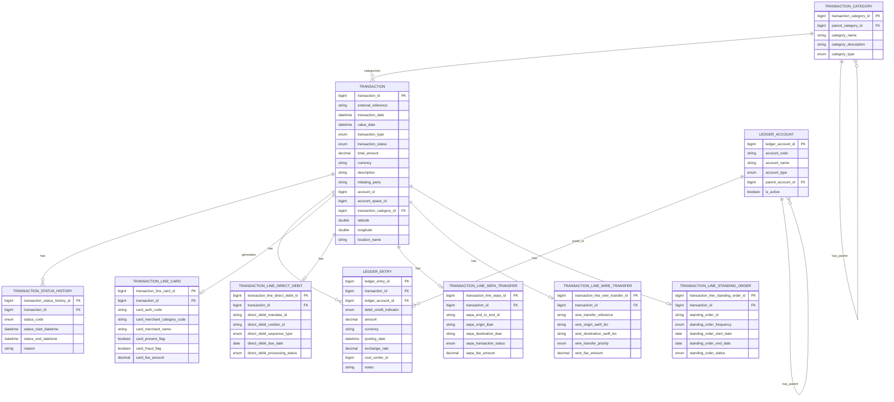

# Core Banking Ledger

A comprehensive banking transaction management and ledger operations system designed for modern financial institutions.

## 🚀 Quickstart

### Prerequisites
- JDK 21
- Maven 3.8+
- Docker (for containerized deployment)

### Local Development Setup
```bash
# Clone the repository
git clone https://github.com/your-organization/core-banking-ledger.git
cd core-banking-ledger

# Build the project
mvn clean install

# Run the application
mvn spring-boot:run -pl core-banking-ledger-web
```

### Docker Deployment
```bash
# Build the Docker image
mvn clean package
docker build -t core-banking-ledger:latest .

# Run the container
docker run -p 8080:8080 core-banking-ledger:latest
```

## 🏗️ Architecture

The Core Banking Ledger is designed as a modular, microservice-based system with a clear separation of concerns:

### Module Structure
- **core-banking-ledger-interfaces**: API contracts, DTOs, and enums
- **core-banking-ledger-models**: Data entities and repository interfaces
- **core-banking-ledger-core**: Business logic and service implementations
- **core-banking-ledger-web**: REST controllers and API endpoints

### Key Components

#### Transaction Processing
Handles various types of financial transactions:
- Card transactions
- Direct debit operations
- SEPA transfers
- Wire transfers
- Standing orders

#### Ledger Management
Provides comprehensive accounting functionality:
- Account management
- Double-entry bookkeeping
- Balance calculation
- Reconciliation
- Financial reporting
- Audit trail

#### Transaction Categorization
Enables classification and organization of transactions for reporting and analysis.

## 📊 Data Model



### Data Model Explanation

The Core Banking Ledger system uses a flexible data model designed to handle various types of financial transactions:

1. **Transaction**: The central entity representing any financial transaction with common attributes like amount, date, and status.

2. **Transaction Lines**: Specialized entities for different transaction types:
   - Card transactions
   - Direct debit operations
   - SEPA transfers
   - Wire transfers
   - Standing orders

3. **Ledger**: Double-entry bookkeeping system with:
   - Ledger accounts (chart of accounts)
   - Ledger entries (debits and credits)

4. **Categories**: Hierarchical classification system for transactions.

5. **Status History**: Tracking of transaction status changes over time.

## 🔧 Configuration

Configuration properties can be set in the `application.yaml` file in the `core-banking-ledger-web/src/main/resources` directory:

```yaml
# Example configuration
spring:
  application:
    name: core-banking-ledger
  r2dbc:
    url: r2dbc:postgresql://localhost:5432/ledger_db
    username: postgres
    password: postgres

server:
  port: 8080
```

## 🛠️ Key Features

### Transaction Management
- Create, retrieve, update, and delete transactions
- Process various payment methods
- Track transaction status changes
- Categorize transactions

### Ledger Operations
- Maintain chart of accounts
- Record double-entry transactions
- Calculate account balances
- Generate financial reports
- Perform reconciliation
- Maintain audit trail

### Reporting
- Trial balance reports
- Income statements
- Balance sheets
- Transaction history reports
- Audit reports

## 🧪 Testing

The project includes comprehensive unit and integration tests:

```bash
# Run all tests
mvn test

# Run specific test class
mvn test -Dtest=TransactionServiceImplTest
```

## 📚 API Documentation

API documentation is available via Swagger UI when the application is running:

```
http://localhost:8080/swagger-ui.html
```

### API Examples Guided by Flows

Below are examples of common API workflows in the Core Banking Ledger system. Each example shows the sequence of API calls needed to complete a specific business process.

#### 1. Creating and Categorizing a Transaction

This flow demonstrates how to create a transaction and assign it to a category.

**Step 1: Create a Transaction Category (if needed)**

```bash
# Create a transaction category
curl -X POST http://localhost:8080/api/v1/transaction-categories \
  -H "Content-Type: application/json" \
  -d '{
    "categoryName": "Utilities",
    "categoryDescription": "Payments for utility services",
    "categoryType": "EXPENSE"
  }'
```

Response:
```json
{
  "transactionCategoryId": 1001,
  "parentCategoryId": null,
  "categoryName": "Utilities",
  "categoryDescription": "Payments for utility services",
  "categoryType": "EXPENSE"
}
```

**Step 2: Create a Transaction**

```bash
# Create a new transaction
curl -X POST http://localhost:8080/api/v1/transactions \
  -H "Content-Type: application/json" \
  -d '{
    "externalReference": "INV-2023-12345",
    "transactionDate": "2023-06-15T14:30:00",
    "valueDate": "2023-06-15T14:30:00",
    "transactionType": "PAYMENT",
    "transactionStatus": "PENDING",
    "totalAmount": 125.50,
    "currency": "EUR",
    "description": "Electricity bill payment",
    "initiatingParty": "John Doe",
    "accountId": 5001,
    "transactionCategoryId": 1001
  }'
```

Response:
```json
{
  "transactionId": 10001,
  "externalReference": "INV-2023-12345",
  "transactionDate": "2023-06-15T14:30:00",
  "valueDate": "2023-06-15T14:30:00",
  "transactionType": "PAYMENT",
  "transactionStatus": "PENDING",
  "totalAmount": 125.50,
  "currency": "EUR",
  "description": "Electricity bill payment",
  "initiatingParty": "John Doe",
  "accountId": 5001,
  "transactionCategoryId": 1001
}
```

**Step 3: Update Transaction Status**

```bash
# Update transaction status to COMPLETED
curl -X PUT http://localhost:8080/api/v1/transactions/10001 \
  -H "Content-Type: application/json" \
  -d '{
    "transactionId": 10001,
    "externalReference": "INV-2023-12345",
    "transactionDate": "2023-06-15T14:30:00",
    "valueDate": "2023-06-15T14:30:00",
    "transactionType": "PAYMENT",
    "transactionStatus": "COMPLETED",
    "totalAmount": 125.50,
    "currency": "EUR",
    "description": "Electricity bill payment",
    "initiatingParty": "John Doe",
    "accountId": 5001,
    "transactionCategoryId": 1001
  }'
```

#### 2. Recording a Card Transaction

This flow demonstrates how to create a transaction for a card payment and add the card-specific details.

**Step 1: Create the Base Transaction**

```bash
# Create a new transaction
curl -X POST http://localhost:8080/api/v1/transactions \
  -H "Content-Type: application/json" \
  -d '{
    "externalReference": "CARD-2023-6789",
    "transactionDate": "2023-06-16T10:15:00",
    "valueDate": "2023-06-16T10:15:00",
    "transactionType": "CARD_PAYMENT",
    "transactionStatus": "COMPLETED",
    "totalAmount": 75.20,
    "currency": "EUR",
    "description": "Grocery store purchase",
    "initiatingParty": "Jane Smith",
    "accountId": 5001,
    "transactionCategoryId": 1002
  }'
```

Response:
```json
{
  "transactionId": 10002,
  "externalReference": "CARD-2023-6789",
  "transactionDate": "2023-06-16T10:15:00",
  "valueDate": "2023-06-16T10:15:00",
  "transactionType": "CARD_PAYMENT",
  "transactionStatus": "COMPLETED",
  "totalAmount": 75.20,
  "currency": "EUR",
  "description": "Grocery store purchase",
  "initiatingParty": "Jane Smith",
  "accountId": 5001,
  "transactionCategoryId": 1002
}
```

**Step 2: Add Card-Specific Details**

```bash
# Add card details to the transaction
curl -X POST http://localhost:8080/api/v1/transactions/10002/line-card \
  -H "Content-Type: application/json" \
  -d '{
    "cardAuthCode": "AUTH123456",
    "cardMerchantCategoryCode": "5411",
    "cardMerchantName": "GROCERY STORE XYZ",
    "cardPresentFlag": true,
    "cardTransactionTimestamp": "2023-06-16T10:15:00",
    "cardFraudFlag": false,
    "cardFeeAmount": 0.50
  }'
```

Response:
```json
{
  "transactionLineCardId": 501,
  "transactionId": 10002,
  "cardAuthCode": "AUTH123456",
  "cardMerchantCategoryCode": "5411",
  "cardMerchantName": "GROCERY STORE XYZ",
  "cardPresentFlag": true,
  "cardTransactionTimestamp": "2023-06-16T10:15:00",
  "cardFraudFlag": false,
  "cardFeeAmount": 0.50
}
```

#### 3. Double-Entry Bookkeeping Flow

This flow demonstrates how to create ledger entries for a transaction, following double-entry bookkeeping principles.

**Step 1: Create Ledger Accounts (if needed)**

```bash
# Create a debit account (e.g., Expense account)
curl -X POST http://localhost:8080/api/v1/ledger-accounts \
  -H "Content-Type: application/json" \
  -d '{
    "accountCode": "5100",
    "accountName": "Utility Expenses",
    "accountType": "EXPENSE",
    "isActive": true
  }'
```

Response:
```json
{
  "ledgerAccountId": 2001,
  "accountCode": "5100",
  "accountName": "Utility Expenses",
  "accountType": "EXPENSE",
  "parentAccountId": null,
  "isActive": true
}
```

```bash
# Create a credit account (e.g., Cash account)
curl -X POST http://localhost:8080/api/v1/ledger-accounts \
  -H "Content-Type: application/json" \
  -d '{
    "accountCode": "1000",
    "accountName": "Cash",
    "accountType": "ASSET",
    "isActive": true
  }'
```

Response:
```json
{
  "ledgerAccountId": 2002,
  "accountCode": "1000",
  "accountName": "Cash",
  "accountType": "ASSET",
  "parentAccountId": null,
  "isActive": true
}
```

**Step 2: Create Debit Ledger Entry**

```bash
# Create debit entry (expense increases)
curl -X POST http://localhost:8080/api/v1/ledger-entries \
  -H "Content-Type: application/json" \
  -d '{
    "transactionId": 10001,
    "ledgerAccountId": 2001,
    "debitCreditIndicator": "DEBIT",
    "amount": 125.50,
    "currency": "EUR",
    "postingDate": "2023-06-15T14:30:00",
    "notes": "Electricity bill payment - debit entry"
  }'
```

Response:
```json
{
  "ledgerEntryId": 3001,
  "transactionId": 10001,
  "ledgerAccountId": 2001,
  "debitCreditIndicator": "DEBIT",
  "amount": 125.50,
  "currency": "EUR",
  "postingDate": "2023-06-15T14:30:00",
  "notes": "Electricity bill payment - debit entry"
}
```

**Step 3: Create Credit Ledger Entry**

```bash
# Create credit entry (cash decreases)
curl -X POST http://localhost:8080/api/v1/ledger-entries \
  -H "Content-Type: application/json" \
  -d '{
    "transactionId": 10001,
    "ledgerAccountId": 2002,
    "debitCreditIndicator": "CREDIT",
    "amount": 125.50,
    "currency": "EUR",
    "postingDate": "2023-06-15T14:30:00",
    "notes": "Electricity bill payment - credit entry"
  }'
```

Response:
```json
{
  "ledgerEntryId": 3002,
  "transactionId": 10001,
  "ledgerAccountId": 2002,
  "debitCreditIndicator": "CREDIT",
  "amount": 125.50,
  "currency": "EUR",
  "postingDate": "2023-06-15T14:30:00",
  "notes": "Electricity bill payment - credit entry"
}
```

#### 4. Generating Financial Reports

This flow demonstrates how to generate various financial reports.

**Trial Balance Report**

```bash
# Generate a trial balance report
curl -X GET "http://localhost:8080/api/v1/reports/trial-balance?startDate=2023-01-01&endDate=2023-06-30"
```

Response:
```
Trial Balance Report
Period: 2023-01-01 to 2023-06-30

Account                                  Account Type    Debit           Credit         
------------------------------------------------------------------------------
Cash                                     ASSET                           1250.75        
Accounts Receivable                      ASSET           3500.00                        
Inventory                                ASSET           12500.00                       
Equipment                                ASSET           8000.00                        
Accounts Payable                         LIABILITY                       2750.00        
Loans Payable                            LIABILITY                       5000.00        
Capital                                  EQUITY                          15000.00       
Revenue                                  REVENUE                         7500.00        
Utility Expenses                         EXPENSE         1250.75                        
Salary Expenses                          EXPENSE         5250.00                        
------------------------------------------------------------------------------
Total                                                    30500.75        31500.75       
```

**Income Statement Report**

```bash
# Generate an income statement report
curl -X GET "http://localhost:8080/api/v1/reports/income-statement?startDate=2023-01-01&endDate=2023-06-30"
```

**Balance Sheet Report**

```bash
# Generate a balance sheet report
curl -X GET "http://localhost:8080/api/v1/reports/balance-sheet?asOfDate=2023-06-30"
```

#### 5. Processing a SEPA Transfer

This flow demonstrates how to create and process a SEPA transfer transaction.

**Step 1: Create the Base Transaction**

```bash
# Create a new transaction
curl -X POST http://localhost:8080/api/v1/transactions \
  -H "Content-Type: application/json" \
  -d '{
    "externalReference": "SEPA-2023-1234",
    "transactionDate": "2023-06-17T09:00:00",
    "valueDate": "2023-06-17T09:00:00",
    "transactionType": "SEPA_TRANSFER",
    "transactionStatus": "PENDING",
    "totalAmount": 1000.00,
    "currency": "EUR",
    "description": "Monthly rent payment",
    "initiatingParty": "John Doe",
    "accountId": 5001
  }'
```

Response:
```json
{
  "transactionId": 10003,
  "externalReference": "SEPA-2023-1234",
  "transactionDate": "2023-06-17T09:00:00",
  "valueDate": "2023-06-17T09:00:00",
  "transactionType": "SEPA_TRANSFER",
  "transactionStatus": "PENDING",
  "totalAmount": 1000.00,
  "currency": "EUR",
  "description": "Monthly rent payment",
  "initiatingParty": "John Doe",
  "accountId": 5001
}
```

**Step 2: Add SEPA-Specific Details**

```bash
# Add SEPA transfer details to the transaction
curl -X POST http://localhost:8080/api/v1/transactions/10003/line-sepa \
  -H "Content-Type: application/json" \
  -d '{
    "sepaEndToEndId": "E2E-REF-12345",
    "sepaOriginIban": "ES9121000418450200051332",
    "sepaOriginBic": "CAIXESBBXXX",
    "sepaDestinationIban": "DE89370400440532013000",
    "sepaDestinationBic": "DEUTDEFFXXX",
    "sepaTransactionStatus": "ACCEPTED",
    "sepaFeeAmount": 2.50
  }'
```

Response:
```json
{
  "transactionLineSepaId": 601,
  "transactionId": 10003,
  "sepaEndToEndId": "E2E-REF-12345",
  "sepaOriginIban": "ES9121000418450200051332",
  "sepaOriginBic": "CAIXESBBXXX",
  "sepaDestinationIban": "DE89370400440532013000",
  "sepaDestinationBic": "DEUTDEFFXXX",
  "sepaTransactionStatus": "ACCEPTED",
  "sepaFeeAmount": 2.50
}
```

**Step 3: Update Transaction Status**

```bash
# Update transaction status to COMPLETED
curl -X PUT http://localhost:8080/api/v1/transactions/10003 \
  -H "Content-Type: application/json" \
  -d '{
    "transactionId": 10003,
    "externalReference": "SEPA-2023-1234",
    "transactionDate": "2023-06-17T09:00:00",
    "valueDate": "2023-06-17T09:00:00",
    "transactionType": "SEPA_TRANSFER",
    "transactionStatus": "COMPLETED",
    "totalAmount": 1000.00,
    "currency": "EUR",
    "description": "Monthly rent payment",
    "initiatingParty": "John Doe",
    "accountId": 5001
  }'
```

**Step 4: Create Ledger Entries**

```bash
# Create debit entry (bank account decreases)
curl -X POST http://localhost:8080/api/v1/ledger-entries \
  -H "Content-Type: application/json" \
  -d '{
    "transactionId": 10003,
    "ledgerAccountId": 2003,
    "debitCreditIndicator": "DEBIT",
    "amount": 1000.00,
    "currency": "EUR",
    "postingDate": "2023-06-17T09:00:00",
    "notes": "Monthly rent payment - debit entry"
  }'
```

```bash
# Create credit entry (expense increases)
curl -X POST http://localhost:8080/api/v1/ledger-entries \
  -H "Content-Type: application/json" \
  -d '{
    "transactionId": 10003,
    "ledgerAccountId": 2004,
    "debitCreditIndicator": "CREDIT",
    "amount": 1000.00,
    "currency": "EUR",
    "postingDate": "2023-06-17T09:00:00",
    "notes": "Monthly rent payment - credit entry"
  }'
```

## 🔍 Monitoring and Logging

The application uses Spring Boot Actuator for monitoring and standard SLF4J for logging:

```
http://localhost:8080/actuator
```

## 🤝 Contributing

1. Create a feature branch from the main branch
2. Make your changes
3. Write or update tests as necessary
4. Submit a pull request
5. Ensure CI checks pass

## 📄 License

This project is licensed under the terms of the license included in the repository.
