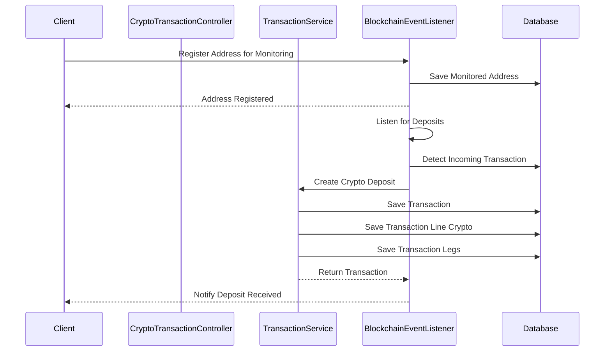
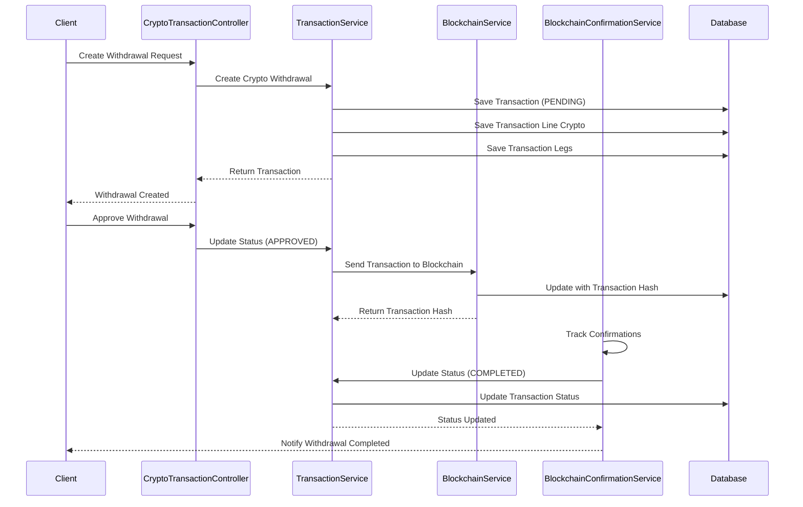

# Core Banking Ledger

A comprehensive banking transaction management system designed for modern financial institutions.

## Table of Contents

1. [Overview](#overview)
2. [Quickstart](#-quickstart)
   - [Prerequisites](#prerequisites)
   - [Local Development Setup](#local-development-setup)
   - [Docker Deployment](#docker-deployment)
3. [Architecture](#-architecture)
   - [Module Structure](#module-structure)
   - [Key Components](#key-components)
4. [Data Model](#-data-model)
   - [Data Model Diagram](#data-model-diagram)
   - [Core Entities](#core-entities)
   - [Blockchain & Crypto Entities](#blockchain--crypto-entities)
   - [Transaction Lines](#transaction-lines)
   - [Entity Relationships](#entity-relationships)
5. [Configuration](#-configuration)
   - [Environment Variables](#environment-variables)
6. [Key Features](#-key-features)
   - [Transaction Management](#transaction-management)
   - [Double-Entry Accounting](#double-entry-accounting)
   - [Event-Driven Architecture](#event-driven-architecture)
   - [Blockchain Integration](#blockchain-integration)
   - [Cryptocurrency Support](#cryptocurrency-support)
   - [Regulatory Compliance](#regulatory-compliance)
   - [Security & Privacy](#security--privacy)
   - [Reporting](#reporting)
7. [Testing](#-testing)
8. [API Documentation](#-api-documentation)
   - [API Controllers](#api-controllers)
   - [API Examples Guided by Flows](#api-examples-guided-by-flows)
9. [Monitoring and Logging](#-monitoring-and-logging)
10. [Contributing](#-contributing)
11. [License](#-license)

## Overview

The Core Banking Ledger is a transaction management system that provides a robust foundation for financial operations. It implements double-entry accounting principles, supports various transaction types including cryptocurrency transactions, and ensures regulatory compliance while maintaining high performance and reliability.

> **Note**: Transaction categories are now managed in an external master data microservice. The `transactionCategoryId` field in the Transaction entity serves as a logical reference to categories in this external service.

## 🚀 Quickstart

### Prerequisites
- JDK 21
- Maven 3.8+
- Docker (for containerized deployment)

### Local Development Setup
```bash
# Clone the repository
git clone https://github.com/firefly-oss/core-banking-ledger.git
cd core-banking-ledger

# Build the project
mvn clean install

# Run the application
mvn spring-boot:run -pl core-banking-ledger-web
```

### Docker Deployment
```bash
# Build the Docker image
mvn clean package
docker build -t core-banking-ledger:latest .

# Run the container
docker run -p 8080:8080 core-banking-ledger:latest
```

## 🏗️ Architecture

The Core Banking Ledger is designed as a modular, microservice-based system with a clear separation of concerns following domain-driven design principles. The architecture ensures scalability, maintainability, and resilience.

### Module Structure

- **core-banking-ledger-interfaces**: Contains all API contracts, Data Transfer Objects (DTOs), and enumerations that define the public interface of the system. This module has minimal dependencies and serves as the contract between the system and its clients.

- **core-banking-ledger-models**: Defines the data entities, repository interfaces, and database migrations. This module encapsulates the persistence layer and data access patterns, using R2DBC for reactive database access.

- **core-banking-ledger-core**: Implements the business logic and service layer. This module contains the core domain logic, transaction processing rules, and service implementations. It follows the hexagonal architecture pattern with clear boundaries between the domain model and external dependencies.

- **core-banking-ledger-web**: Provides the REST API endpoints and controllers that expose the system's functionality to clients. This module handles HTTP requests, input validation, and response formatting, delegating business logic to the core module.


### Key Components

#### Transaction Processing Engine

The transaction processing engine is the heart of the Core Banking Ledger system. It handles various types of financial transactions with specialized processing logic for each type:

- **Card Transactions**: Processes debit and credit card payments with merchant details, authorization codes, and fraud detection flags.
- **Direct Debit Operations**: Manages automated payments to vendors with mandate information and sequence types.
- **SEPA Transfers**: Handles European payment transfers with IBAN/BIC validation and SEPA-specific fields.
- **Wire Transfers**: Processes international wire transfers with SWIFT codes and cross-border compliance checks.
- **Standing Orders**: Manages recurring scheduled payments with frequency and execution tracking.
- **Deposit Transactions**: Records cash or check deposits with detailed source information.
- **Withdrawal Transactions**: Records cash withdrawals with ATM or branch details and limit checks.
- **Fee Transactions**: Manages various banking fees with calculation methods and waiver tracking.
- **Interest Transactions**: Calculates and applies interest payments or charges with accrual periods.
- **Transfer Transactions**: Handles internal transfers between accounts with purpose codes.
- **Cryptocurrency Transactions**: Processes cryptocurrency deposits, withdrawals, transfers, and swaps with blockchain integration.
- **Token Operations**: Manages token minting, burning, and transfers, including NFT transactions.
- **Staking Operations**: Handles cryptocurrency staking, unstaking, and reward distribution.

#### Blockchain Integration Framework

The system includes a comprehensive blockchain integration framework for interacting with various blockchain networks:

- **Blockchain Network Management**: Supports multiple blockchain networks (Ethereum, Bitcoin, etc.) with network-specific configurations.
- **Transaction Monitoring**: Listens for blockchain events like deposits, token transfers, and smart contract events.
- **Transaction Broadcasting**: Sends transactions to blockchain networks with proper gas fee estimation.
- **Confirmation Tracking**: Monitors transaction confirmations and updates transaction status accordingly.
- **Address Management**: Registers and monitors blockchain addresses for incoming transactions.
- **Smart Contract Interaction**: Interacts with smart contracts for token operations and other blockchain functions.

#### Double-Entry Accounting System

The system implements proper double-entry accounting principles to ensure financial integrity:

- **Transaction Legs**: Each transaction consists of at least two legs (debit and credit) that always balance to zero.
- **Balance Calculation**: Account balances are calculated based on the sum of transaction legs.
- **Multi-Currency Support**: Handles transactions in different currencies with proper exchange rate tracking.
- **Multi-Asset Support**: Supports both fiat currencies and cryptocurrencies with proper accounting.
- **Booking vs. Value Date**: Distinguishes between when a transaction is booked and when it affects interest calculations.

#### Event-Driven Integration Framework

The system uses an event-driven architecture for reliable integration with other systems:

- **Event Outbox Pattern**: Ensures reliable event publishing even in the face of failures.
- **Domain Events**: Publishes events for transaction lifecycle (created, updated, status changed).
- **Idempotent Processing**: Prevents duplicate transactions with unique external references and request IDs.
- **Asynchronous Communication**: Enables loose coupling between services through event-based integration.
- **Blockchain Event Processing**: Processes blockchain events asynchronously to update transaction status.

#### Transaction Relationship Management

The system tracks relationships between transactions for comprehensive financial history:

- **Related Transactions**: Links transactions that are related (e.g., original transaction and its reversal).
- **Relation Types**: Categorizes relationships as reversals, adjustments, chargebacks, or corrections.
- **Batch Processing**: Groups related transactions with batch IDs for bulk operations.
- **Audit Trail**: Maintains a complete history of transaction status changes with reasons.
- **Blockchain Transaction Tracking**: Links on-chain transactions with internal ledger transactions.

#### Regulatory Compliance Framework

The system includes features to ensure compliance with financial regulations:

- **Anti-Money Laundering (AML)**: Risk scoring, screening results, and large transaction flagging.
- **Strong Customer Authentication (SCA)**: Tracks authentication methods and results for PSD2/PSD3 compliance.
- **Instant Payments**: Supports instant payment schemes with confirmation of payee functionality.
- **EU Regulations**: Designed for PSD3 and EU Instant Payments Regulation 2024/886 compliance.
- **Spanish Tax Reporting**: Includes fields for Spanish tax codes and reporting requirements.
- **Crypto Compliance**: Includes crypto-specific compliance checks and risk scoring for blockchain addresses.

#### Transaction Categorization System

Enables classification and organization of transactions for reporting and analysis:

- **External Category Management**: Transaction categories are now managed in an external master data microservice, with the transaction_category_id field serving as a logical reference to categories in this external service.

## 📊 Data Model

### Data Model Diagram

```mermaid
erDiagram
    %% Core Entities
    TRANSACTION {
        bigint transaction_id PK
        string external_reference
        datetime transaction_date
        datetime value_date
        datetime booking_date
        enum transaction_type
        enum transaction_status
        decimal total_amount
        string currency
        string description
        string initiating_party
        bigint account_id
        bigint account_space_id
        bigint transaction_category_id FK
        bigint related_transaction_id FK
        string relation_type
        string request_id
        string batch_id
        bigint row_version
        integer aml_risk_score
        string aml_screening_result
        boolean aml_large_txn_flag
        string sca_method
        string sca_result
        boolean instant_flag
        string confirmation_of_payee_result
        double latitude
        double longitude
        string location_name
        string country
        string city
        string postal_code
        string branch_office_code
        string nif_initiating_party
        enum asset_type
        bigint blockchain_network_id FK
        string blockchain_transaction_hash
        string crypto_compliance_check_result
        integer crypto_address_risk_score
        string crypto_transaction_source
        datetime date_created
        datetime date_updated
    }

    TRANSACTION_LEG {
        bigint transaction_leg_id PK
        bigint transaction_id FK
        bigint account_id
        bigint account_space_id
        string leg_type
        decimal amount
        string currency
        string description
        datetime value_date
        datetime booking_date
        datetime date_created
        datetime date_updated
    }

    EVENT_OUTBOX {
        uuid event_id PK
        string aggregate_type
        string aggregate_id
        string event_type
        jsonb payload
        datetime created_at
        boolean processed
        datetime processed_at
        integer retry_count
        text last_error
    }

    MONEY {
        bigint money_id PK
        decimal amount
        string currency
        enum asset_type
        bigint crypto_asset_id FK
        datetime date_created
        datetime date_updated
    }

    %% Blockchain & Crypto Entities
    BLOCKCHAIN_NETWORK {
        bigint blockchain_network_id PK
        string network_name
        string network_code
        boolean is_testnet
        string blockchain_explorer_url
        datetime date_created
        datetime date_updated
    }

    CRYPTO_ASSET {
        bigint crypto_asset_id PK
        string asset_symbol
        string asset_name
        enum asset_type
        bigint blockchain_network_id FK
        string contract_address
        integer decimals
        boolean is_active
        datetime date_created
        datetime date_updated
    }

    TRANSACTION_LINE_CRYPTO {
        bigint transaction_line_crypto_id PK
        bigint transaction_id FK
        bigint crypto_asset_id FK
        string blockchain_transaction_hash
        string sender_address
        string recipient_address
        bigint block_number
        datetime block_timestamp
        integer confirmation_count
        decimal gas_price
        bigint gas_used
        decimal transaction_fee
        string fee_currency
        string network_status
        datetime date_created
        datetime date_updated
    }

    NFT_METADATA {
        bigint nft_metadata_id PK
        bigint crypto_asset_id FK
        string token_id
        string token_standard
        string metadata_uri
        string token_name
        string token_description
        string creator_address
        datetime creation_date
        datetime date_created
        datetime date_updated
    }

    TRANSACTION_ATTACHMENT {
        bigint transaction_attachment_id PK
        bigint transaction_id FK
        string attachment_type
        string attachment_name
        string attachment_description
        string document_id
        string content_type
        bigint size_bytes
        string hash_sha256
        string uploaded_by
        datetime upload_date
        datetime date_created
        datetime date_updated
    }

    STATEMENT {
        bigint statement_id PK
        bigint account_id
        bigint account_space_id
        enum period_type
        date start_date
        date end_date
        datetime generation_date
        integer transaction_count
        boolean included_pending
        boolean included_details
        datetime date_created
        datetime date_updated
    }

    TRANSACTION_STATUS_HISTORY {
        bigint transaction_status_history_id PK
        bigint transaction_id FK
        enum status_code
        datetime status_start_datetime
        datetime status_end_datetime
        string reason
        boolean regulated_reporting_flag
        datetime date_created
        datetime date_updated
    }

    %% Relationships
    TRANSACTION ||--o{ TRANSACTION_LEG : "has"
    TRANSACTION ||--o{ TRANSACTION_STATUS_HISTORY : "has"
    TRANSACTION ||--o{ TRANSACTION_ATTACHMENT : "has"
    TRANSACTION ||--o| TRANSACTION : "relates to"
    TRANSACTION ||--o| TRANSACTION_LINE_CRYPTO : "has"
    TRANSACTION }o--|| BLOCKCHAIN_NETWORK : "uses"
    
    MONEY }o--o| CRYPTO_ASSET : "references"
    
    CRYPTO_ASSET }o--|| BLOCKCHAIN_NETWORK : "belongs to"
    CRYPTO_ASSET ||--o{ NFT_METADATA : "has"
    
    TRANSACTION_LINE_CRYPTO }o--|| CRYPTO_ASSET : "references"
    
    %% Statement Relationships
    STATEMENT }o--o{ TRANSACTION : "includes"
```



### Core Entities

#### Transaction

The `TRANSACTION` table is the central entity representing any financial transaction. It contains common attributes applicable to all transaction types:

- **Basic Information**:
  - `transaction_id`: Unique identifier for the transaction
  - `external_reference`: External system reference (e.g., payment processor ID)
  - `description`: Human-readable description of the transaction
  - `total_amount`: Total monetary value of the transaction
  - `currency`: ISO 4217 currency code (e.g., EUR, USD)
  - `transaction_type`: Type of transaction (PAYMENT, CARD_PAYMENT, SEPA_TRANSFER, CRYPTO_DEPOSIT, etc.)
  - `transaction_status`: Current status (PENDING, COMPLETED, FAILED, REVERSED)

- **Temporal Data**:
  - `transaction_date`: When the transaction was initiated
  - `value_date`: Date used for interest calculations
  - `booking_date`: When the transaction affects the account balance

- **Account References**:
  - `account_id`: Reference to account in external account microservice
  - `account_space_id`: Reference to account space in external account microservice
  - `transaction_category_id`: Reference to category in external master data microservice

- **Relation Fields**:
  - `related_transaction_id`: Link to related transaction (e.g., original transaction for a reversal)
  - `relation_type`: Type of relationship (REVERSAL, ADJUSTMENT, CHARGEBACK, CORRECTION)
  - `request_id`: Unique ID for idempotency support
  - `batch_id`: ID for grouping related transactions in bulk operations

- **Concurrency Control**:
  - `row_version`: Version number for optimistic locking

- **Regulatory Compliance**:
  - `aml_risk_score`: Anti-Money Laundering risk score
  - `aml_screening_result`: Result of AML screening
  - `aml_large_txn_flag`: Flag for transactions exceeding reporting thresholds
  - `sca_method`: Strong Customer Authentication method used
  - `sca_result`: Result of the SCA verification
  - `instant_flag`: Whether this is an instant payment
  - `confirmation_of_payee_result`: Result of name checking (OK, MISMATCH, UNAVAILABLE)

- **Crypto and Blockchain Fields**:
  - `asset_type`: Type of asset (FIAT, CRYPTOCURRENCY, TOKEN_SECURITY, etc.)
  - `blockchain_network_id`: Reference to blockchain network for crypto transactions
  - `blockchain_transaction_hash`: Transaction hash on the blockchain
  - `crypto_compliance_check_result`: Result of compliance checks for crypto transactions
  - `crypto_address_risk_score`: Risk score for crypto addresses involved
  - `crypto_transaction_source`: Source of the crypto transaction (EXCHANGE, WALLET, SMART_CONTRACT)

- **Geolocation**:
  - `latitude`, `longitude`: Coordinates of transaction origin
  - `location_name`: Human-readable location name
  - `country`: Country code
  - `city`: City name
  - `postal_code`: Postal/ZIP code

- **Organizational Data**:
  - `branch_office_code`: Branch where transaction was initiated
  - `nif_initiating_party`: Spanish tax ID of initiating party

- **Audit Trail**:
  - `date_created`: When the record was created
  - `date_updated`: When the record was last updated

#### Transaction Legs

The `TRANSACTION_LEG` table implements double-entry accounting principles. Each transaction consists of at least two legs (debit and credit) that always balance to zero:

- **Identifiers**:
  - `transaction_leg_id`: Unique identifier for the leg
  - `transaction_id`: Reference to the parent transaction

- **Account Information**:
  - `account_id`: Reference to account in external account microservice
  - `account_space_id`: Reference to account space in external account microservice

- **Financial Details**:
  - `leg_type`: DEBIT or CREDIT indicator
  - `amount`: Monetary value for this leg
  - `currency`: ISO 4217 currency code
  - `description`: Leg-specific description

- **Temporal Data**:
  - `value_date`: Date used for interest calculations
  - `booking_date`: When the leg affects the account balance

- **Audit Trail**:
  - `date_created`: When the record was created
  - `date_updated`: When the record was last updated

#### Money

The `MONEY` table serves as a value object for consistent handling of amount and currency:

- **Identifiers**:
  - `money_id`: Unique identifier

- **Value Components**:
  - `amount`: Decimal value with four decimal places for precision
  - `currency`: ISO 4217 currency code (e.g., EUR, USD)
  - `asset_type`: Type of asset (FIAT, CRYPTOCURRENCY, TOKEN_SECURITY, etc.)
  - `crypto_asset_id`: Reference to crypto_asset table for cryptocurrency and token assets

- **Audit Trail**:
  - `date_created`: When the record was created
  - `date_updated`: When the record was last updated

### Blockchain & Crypto Entities

#### Blockchain Network

The `BLOCKCHAIN_NETWORK` table stores information about supported blockchain networks:

- **Identifiers**:
  - `blockchain_network_id`: Unique identifier for the blockchain network

- **Network Information**:
  - `network_name`: Name of the blockchain network (e.g., Ethereum Mainnet, Bitcoin)
  - `network_code`: Code for the blockchain network (e.g., ETH, BTC)
  - `is_testnet`: Whether this is a testnet or mainnet
  - `blockchain_explorer_url`: URL for the blockchain explorer

- **Audit Trail**:
  - `date_created`: When the record was created
  - `date_updated`: When the record was last updated

#### Crypto Asset

The `CRYPTO_ASSET` table stores information about supported cryptocurrencies and tokens:

- **Identifiers**:
  - `crypto_asset_id`: Unique identifier for the crypto asset

- **Asset Information**:
  - `asset_symbol`: Symbol of the cryptocurrency or token (e.g., BTC, ETH)
  - `asset_name`: Name of the cryptocurrency or token (e.g., Bitcoin, Ethereum)
  - `asset_type`: Type of asset (CRYPTOCURRENCY, TOKEN_SECURITY, TOKEN_UTILITY, TOKEN_NFT)
  - `blockchain_network_id`: Reference to the blockchain network
  - `contract_address`: Address of the token contract (for tokens like ERC-20)
  - `decimals`: Number of decimal places for the asset
  - `is_active`: Whether the asset is active

- **Audit Trail**:
  - `date_created`: When the record was created
  - `date_updated`: When the record was last updated

#### Transaction Line Crypto

The `TRANSACTION_LINE_CRYPTO` table stores crypto-specific transaction details:

- **Identifiers**:
  - `transaction_line_crypto_id`: Unique identifier
  - `transaction_id`: Reference to the parent transaction
  - `crypto_asset_id`: Reference to the crypto asset

- **Blockchain Details**:
  - `blockchain_transaction_hash`: Hash of the transaction on the blockchain
  - `sender_address`: Blockchain address of the sender
  - `recipient_address`: Blockchain address of the recipient
  - `block_number`: Block number where the transaction was included
  - `block_timestamp`: Timestamp of the block
  - `confirmation_count`: Number of confirmations for the transaction

- **Fee Information**:
  - `gas_price`: Price of gas used for the transaction
  - `gas_used`: Amount of gas used for the transaction
  - `transaction_fee`: Fee paid for the transaction
  - `fee_currency`: Currency of the fee

- **Status Information**:
  - `network_status`: Status of the transaction on the network

- **Audit Trail**:
  - `date_created`: When the record was created
  - `date_updated`: When the record was last updated

#### NFT Metadata

The `NFT_METADATA` table stores metadata for NFT tokens:

- **Identifiers**:
  - `nft_metadata_id`: Unique identifier
  - `crypto_asset_id`: Reference to the crypto asset
  - `token_id`: ID of the token within the contract

- **Token Information**:
  - `token_standard`: Token standard (ERC-721, ERC-1155, etc.)
  - `metadata_uri`: URI for the token metadata
  - `token_name`: Name of the token
  - `token_description`: Description of the token
  - `creator_address`: Blockchain address of the creator
  - `creation_date`: When the token was created

- **Audit Trail**:
  - `date_created`: When the record was created
  - `date_updated`: When the record was last updated

### Transaction Lines

The system uses specialized transaction line tables for different transaction types, each capturing type-specific details. In addition to the traditional transaction lines (Card, Direct Debit, SEPA Transfer, etc.), the system now includes a specialized transaction line for cryptocurrency transactions:

#### Crypto Transactions (`TRANSACTION_LINE_CRYPTO`)

- **Asset Information**:
  - `crypto_asset_id`: Reference to the crypto asset involved in the transaction
  - `sender_address`: Blockchain address of the sender
  - `recipient_address`: Blockchain address of the recipient

- **Blockchain Details**:
  - `blockchain_transaction_hash`: Hash of the transaction on the blockchain
  - `block_number`: Block number where the transaction was included
  - `block_timestamp`: Timestamp of the block
  - `confirmation_count`: Number of confirmations for the transaction

- **Fee Information**:
  - `gas_price`: Price of gas used for the transaction
  - `gas_used`: Amount of gas used for the transaction
  - `transaction_fee`: Fee paid for the transaction
  - `fee_currency`: Currency of the fee

- **Status Information**:
  - `network_status`: Status of the transaction on the network

### Entity Relationships

The Core Banking Ledger system has a well-defined set of relationships between entities:

#### Core Relationships

- **Transaction to Transaction Legs**: One-to-many relationship. Each transaction has at least two legs (debit and credit) to implement double-entry accounting.

- **Transaction to Transaction Status History**: One-to-many relationship. Each transaction has a history of status changes with timestamps and reasons.

- **Transaction to Transaction Attachments**: One-to-many relationship. A transaction can have multiple supporting documents attached.

- **Transaction to Transaction**: Self-referential relationship. A transaction can be related to another transaction (e.g., a reversal transaction references the original transaction).

#### Blockchain & Crypto Relationships

- **Transaction to Blockchain Network**: Many-to-one relationship. A cryptocurrency transaction is associated with a specific blockchain network.

- **Transaction to Transaction Line Crypto**: One-to-one relationship. A cryptocurrency transaction has one specialized crypto transaction line.

- **Transaction Line Crypto to Crypto Asset**: Many-to-one relationship. A crypto transaction line references a specific crypto asset.

- **Crypto Asset to Blockchain Network**: Many-to-one relationship. A crypto asset belongs to a specific blockchain network.

- **Crypto Asset to NFT Metadata**: One-to-many relationship. An NFT crypto asset can have multiple token instances, each with its own metadata.

- **Money to Crypto Asset**: Many-to-one relationship. A money value can reference a specific crypto asset when representing cryptocurrency amounts.

#### External References

- **Transaction Categories**: Now managed in an external master data microservice, with the `transaction_category_id` field serving as a logical reference.

- **Accounts and Account Spaces**: Managed in an external account microservice, with the `account_id` and `account_space_id` fields serving as logical references.

- **Document Management**: Transaction attachments reference documents in an external ECM system using the `document_id` field.

## 🔧 Configuration

Configuration properties can be set in the `application.yaml` file in the `core-banking-ledger-web/src/main/resources` directory:

```yaml
# Example configuration
spring:
  application:
    name: core-banking-ledger
    version: 1.0.0
    description: Banking Ledger Core Application
    team:
      name: Catalis Development
      email: dev@catalis.com

  r2dbc:
    pool:
      initial-size: 5
      max-size: 10
      max-idle-time: 30m
      validation-query: SELECT 1
    url: r2dbc:postgresql://${DB_HOST}:${DB_PORT}/${DB_NAME}?sslMode=${DB_SSL_MODE}
    username: ${DB_USERNAME}
    password: ${DB_PASSWORD}

  flyway:
    enabled: true
    baseline-on-migrate: true
    locations: classpath:db/migration
    url: jdbc:postgresql://${DB_HOST}:${DB_PORT}/${DB_NAME}?sslMode=${DB_SSL_MODE}
    user: ${DB_USERNAME}
    password: ${DB_PASSWORD}

  threads:
    virtual:
      enabled: true

server:
  port: 8080
  shutdown: graceful

# Blockchain configuration
blockchain:
  networks:
    ethereum:
      enabled: true
      rpc-url: ${ETH_RPC_URL}
      chain-id: ${ETH_CHAIN_ID}
      explorer-url: ${ETH_EXPLORER_URL}
      gas-price-strategy: MEDIUM
      confirmation-blocks: 12
    bitcoin:
      enabled: ${BTC_ENABLED:false}
      rpc-url: ${BTC_RPC_URL:}
      rpc-user: ${BTC_RPC_USER:}
      rpc-password: ${BTC_RPC_PASSWORD:}
      confirmation-blocks: 6
  event-listener:
    polling-interval-seconds: 15
    max-blocks-per-poll: 100
    retry-delay-seconds: 30
    max-retries: 5

springdoc:
  api-docs:
    enabled: true
    path: /v3/api-docs
  swagger-ui:
    path: /swagger-ui.html
    tagsSorter: alpha
    operationsSorter: method
    docExpansion: none
    filter: true
  packages-to-scan: com.catalis.core.banking.ledger.web.controllers
  paths-to-match: /api/**
```

### Environment Variables

The application uses the following environment variables for configuration:

| Variable | Description | Default Value |
|----------|-------------|---------------|
| `DB_HOST` | Database host | localhost |
| `DB_PORT` | Database port | 5432 |
| `DB_NAME` | Database name | ledger_db |
| `DB_SSL_MODE` | Database SSL mode | prefer |
| `DB_USERNAME` | Database username | postgres |
| `DB_PASSWORD` | Database password | postgres |
| `ETH_RPC_URL` | Ethereum RPC URL | - |
| `ETH_CHAIN_ID` | Ethereum chain ID | 1 (mainnet) |
| `ETH_EXPLORER_URL` | Ethereum explorer URL | https://etherscan.io |
| `BTC_ENABLED` | Enable Bitcoin support | false |
| `BTC_RPC_URL` | Bitcoin RPC URL | - |
| `BTC_RPC_USER` | Bitcoin RPC username | - |
| `BTC_RPC_PASSWORD` | Bitcoin RPC password | - |

You can set these environment variables in your development environment or provide them when running the Docker container.

## 🛠️ Key Features

### Transaction Management
- Create, retrieve, update, and delete transactions
- Process various payment methods including cryptocurrency transactions
- Track transaction status changes
- Categorize transactions
- Support for transaction reversals and related transactions
- Idempotent transaction processing with unique external references

### Double-Entry Accounting
- Transaction legs for debit and credit entries
- Balance calculation based on transaction legs
- Support for multi-currency transactions
- Support for multi-asset transactions (fiat and crypto)
- Proper accounting for reversals and adjustments

### Event-Driven Architecture
- Event outbox pattern for reliable event publishing
- Domain events for transaction lifecycle
- Asynchronous integration with other services
- Blockchain event processing for transaction status updates

### Blockchain Integration
- Support for multiple blockchain networks (Ethereum, Bitcoin, etc.)
- Transaction broadcasting with gas fee estimation
- Transaction confirmation tracking
- Blockchain event monitoring
- Smart contract interaction
- Address management for deposits and withdrawals
- Secure key management and signing

### Cryptocurrency Support
- Support for various cryptocurrency transaction types:
  - Deposits: Receive cryptocurrencies from external wallets
  - Withdrawals: Send cryptocurrencies to external wallets
  - Transfers: Move cryptocurrencies between internal accounts
  - Swaps: Exchange one cryptocurrency for another
- Token operations:
  - Minting: Create new tokens
  - Burning: Destroy tokens
  - Transfers: Move tokens between accounts
- NFT support:
  - NFT transfers
  - NFT metadata tracking
- Staking operations:
  - Staking: Lock cryptocurrencies to earn rewards
  - Unstaking: Unlock staked cryptocurrencies
  - Reward distribution: Distribute staking rewards
- Crypto-specific compliance:
  - Address risk scoring
  - Transaction source tracking
  - Compliance check results

### Regulatory Compliance
- AML risk scoring and screening results
- Strong Customer Authentication (SCA) tracking
- Support for instant payments and confirmation of payee
- Designed for PSD3 and EU Instant Payments Regulation 2024/886
- Crypto-specific compliance checks and risk scoring

### Security & Privacy
- Transaction attachments with hash verification
- Optimistic locking to prevent concurrent updates
- Secure blockchain key management
- Address validation and risk assessment

### Reporting
- Account and account space statements
- Transaction history reports
- Audit reports
- Transaction leg reports for accounting reconciliation
- Cryptocurrency holdings reports

## 🧪 Testing

The project includes comprehensive unit and integration tests. All tests are currently passing (98 tests in total).

```bash
# Run all tests
mvn test

# Run specific test class
mvn test -Dtest=TransactionServiceImplTest

# Run crypto-specific tests
mvn test -Dtest=TransactionServiceImplTest_CryptoMethods
```

The tests cover all major components of the system, including:
- Transaction services
- Transaction line services for different payment methods
- Transaction categorization
- Status history tracking
- Blockchain integration services
- Cryptocurrency transaction processing

## 📚 API Documentation

API documentation is available via Swagger UI when the application is running:

```
http://localhost:8080/swagger-ui.html
```

### API Controllers

The Core Banking Ledger system provides the following REST controllers for interacting with the API:

#### Core Controllers
- **TransactionController**: Manages basic transaction operations (create, read, update, delete)
  - Create, retrieve, update, and delete transactions
  - Update transaction status with reason
  - Create reversal transactions
  - Find transactions by external reference
- **TransactionStatusHistoryController**: Tracks changes in transaction status over time
- **TransactionCategoryController**: Manages transaction categorization

#### Double-Entry Accounting Controllers
- **TransactionLegController**: Manages transaction legs for double-entry accounting
- **AccountLegController**: Queries transaction legs by account

#### Event & Integration Controllers
- **EventOutboxController**: Manages the event outbox for reliable event publishing

#### Blockchain & Crypto Controllers
- **BlockchainController**: Manages blockchain interactions
  - Send transactions to blockchain networks
  - Get transaction status from blockchain
  - Track transaction confirmations
  - Get gas prices
  - Estimate gas for transactions
- **BlockchainEventListenerController**: Manages blockchain event listening
  - Listen for deposit events
  - Listen for token transfer events
  - Listen for smart contract events
  - Register addresses for monitoring
- **BlockchainConfirmationController**: Manages blockchain transaction confirmations
  - Track confirmations for transactions
  - Check transaction status on blockchain
- **CryptoTransactionController**: Manages cryptocurrency transactions
  - Create crypto deposits
  - Create crypto withdrawals
  - Create crypto transfers
  - Create token operations (mint, burn, transfer)

#### Attachment Controllers
- **TransactionAttachmentController**: Manages attachments related to transactions

#### Transaction Line Controllers
- **TransactionLineCardController**: Manages card payment transaction lines
- **TransactionLineDirectDebitController**: Manages direct debit transaction lines
- **TransactionLineSepaTransferController**: Manages SEPA transfer transaction lines
- **TransactionLineWireTransferController**: Manages wire transfer transaction lines
- **TransactionLineStandingOrderController**: Manages standing order transaction lines
- **TransactionLineDepositController**: Manages deposit transaction lines
- **TransactionLineWithdrawalController**: Manages withdrawal transaction lines
- **TransactionLineFeeController**: Manages fee transaction lines
- **TransactionLineInterestController**: Manages interest transaction lines
- **TransactionLineTransferController**: Manages general transfer transaction lines
- **TransactionLineCryptoController**: Manages cryptocurrency transaction lines

### API Examples Guided by Flows

Below are examples of common API workflows in the Core Banking Ledger system. Each example shows the sequence of API calls needed to complete a specific business process.

#### Cryptocurrency Deposit Flow



#### Cryptocurrency Withdrawal Flow



## 📝 Monitoring and Logging

The Core Banking Ledger system includes comprehensive monitoring and logging capabilities:

### Logging

- Structured JSON logging with correlation IDs for request tracing
- Configurable log levels (INFO, DEBUG, ERROR, etc.)
- Transaction audit logging for regulatory compliance
- Error logging with detailed exception information
- Blockchain transaction logging for tracking on-chain activities

### Monitoring

- Health check endpoints for infrastructure monitoring
- Prometheus metrics for performance monitoring
- Micrometer integration for collecting application metrics
- Dashboard templates for Grafana visualization
- Blockchain-specific metrics for monitoring network interactions

### Alerting

- Configurable alert thresholds for critical metrics
- Integration with notification systems
- Automated incident response workflows
- Blockchain confirmation alerts for delayed transactions

## 💪 Contributing

Contributions to the Core Banking Ledger project are welcome! Please follow these steps:

1. Fork the repository
2. Create a feature branch (`git checkout -b feature/amazing-feature`)
3. Commit your changes (`git commit -m 'Add some amazing feature'`)
4. Push to the branch (`git push origin feature/amazing-feature`)
5. Open a Pull Request

Please ensure your code follows the project's coding standards and includes appropriate tests.

## 📜 License

This project is licensed under the Apache License 2.0 - see the LICENSE file for details.