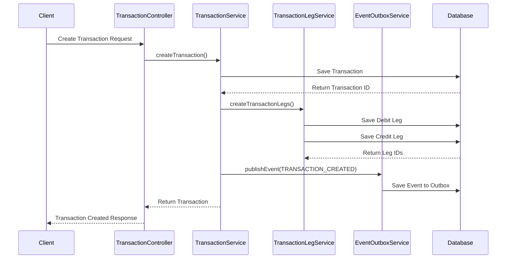
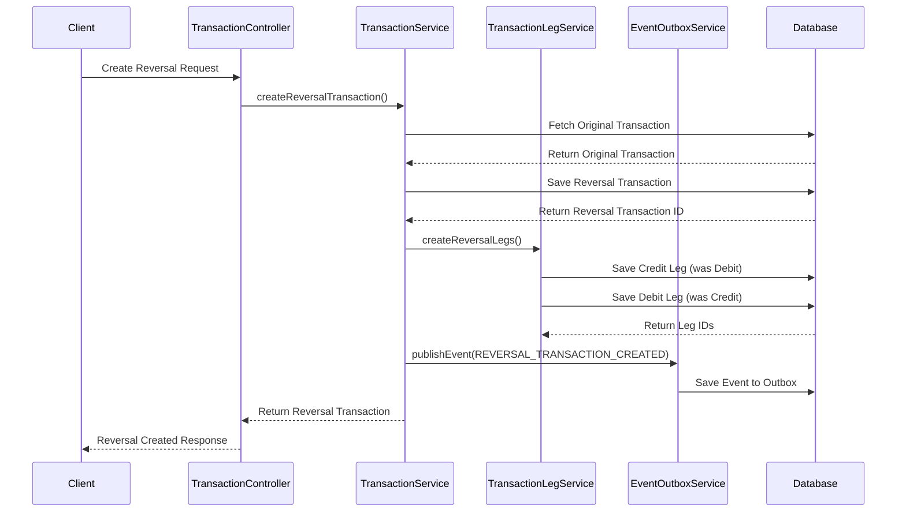
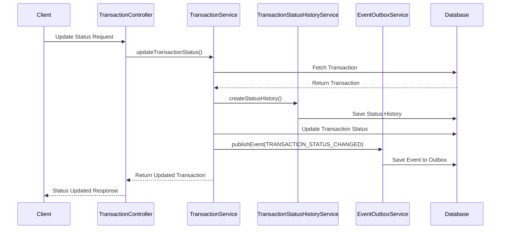

# Core Banking Ledger

A comprehensive banking transaction management system designed for modern financial institutions.

## Table of Contents

1. [Overview](#overview)
2. [Quickstart](#-quickstart)
   - [Prerequisites](#prerequisites)
   - [Local Development Setup](#local-development-setup)
   - [Docker Deployment](#docker-deployment)
3. [Architecture](#-architecture)
   - [Module Structure](#module-structure)
   - [Key Components](#key-components)
4. [Data Model](#-data-model)
   - [Data Model Diagram](#data-model-diagram)
   - [Core Entities](#core-entities)
   - [Transaction Lines](#transaction-lines)
   - [Entity Relationships](#entity-relationships)
5. [Configuration](#-configuration)
   - [Environment Variables](#environment-variables)
6. [Key Features](#-key-features)
   - [Transaction Management](#transaction-management)
   - [Double-Entry Accounting](#double-entry-accounting)
   - [Event-Driven Architecture](#event-driven-architecture)
   - [Regulatory Compliance](#regulatory-compliance)
   - [Security & Privacy](#security--privacy)
   - [Reporting](#reporting)
7. [Testing](#-testing)
8. [API Documentation](#-api-documentation)
   - [API Controllers](#api-controllers)
   - [API Examples Guided by Flows](#api-examples-guided-by-flows)
9. [Monitoring and Logging](#-monitoring-and-logging)
10. [Contributing](#-contributing)
11. [License](#-license)

## Overview

The Core Banking Ledger is a transaction management system that provides a robust foundation for financial operations. It implements double-entry accounting principles, supports various transaction types, and ensures regulatory compliance while maintaining high performance and reliability.

> **Note**: Transaction categories are now managed in an external master data microservice. The `transactionCategoryId` field in the Transaction entity serves as a logical reference to categories in this external service.

## 🚀 Quickstart

### Prerequisites
- JDK 21
- Maven 3.8+
- Docker (for containerized deployment)

### Local Development Setup
```bash
# Clone the repository
git clone https://github.com/firefly-oss/core-banking-ledger.git
cd core-banking-ledger

# Build the project
mvn clean install

# Run the application
mvn spring-boot:run -pl core-banking-ledger-web
```

### Docker Deployment
```bash
# Build the Docker image
mvn clean package
docker build -t core-banking-ledger:latest .

# Run the container
docker run -p 8080:8080 core-banking-ledger:latest
```

## 🏗️ Architecture

The Core Banking Ledger is designed as a modular, microservice-based system with a clear separation of concerns following domain-driven design principles. The architecture ensures scalability, maintainability, and resilience.

### Module Structure

- **core-banking-ledger-interfaces**: Contains all API contracts, Data Transfer Objects (DTOs), and enumerations that define the public interface of the system. This module has minimal dependencies and serves as the contract between the system and its clients.

- **core-banking-ledger-models**: Defines the data entities, repository interfaces, and database migrations. This module encapsulates the persistence layer and data access patterns, using R2DBC for reactive database access.

- **core-banking-ledger-core**: Implements the business logic and service layer. This module contains the core domain logic, transaction processing rules, and service implementations. It follows the hexagonal architecture pattern with clear boundaries between the domain model and external dependencies.

- **core-banking-ledger-web**: Provides the REST API endpoints and controllers that expose the system's functionality to clients. This module handles HTTP requests, input validation, and response formatting, delegating business logic to the core module.


### Key Components

#### Transaction Processing Engine

The transaction processing engine is the heart of the Core Banking Ledger system. It handles various types of financial transactions with specialized processing logic for each type:

- **Card Transactions**: Processes debit and credit card payments with merchant details, authorization codes, and fraud detection flags.
- **Direct Debit Operations**: Manages automated payments to vendors with mandate information and sequence types.
- **SEPA Transfers**: Handles European payment transfers with IBAN/BIC validation and SEPA-specific fields.
- **Wire Transfers**: Processes international wire transfers with SWIFT codes and cross-border compliance checks.
- **Standing Orders**: Manages recurring scheduled payments with frequency and execution tracking.
- **Deposit Transactions**: Records cash or check deposits with detailed source information.
- **Withdrawal Transactions**: Records cash withdrawals with ATM or branch details and limit checks.
- **Fee Transactions**: Manages various banking fees with calculation methods and waiver tracking.
- **Interest Transactions**: Calculates and applies interest payments or charges with accrual periods.
- **Transfer Transactions**: Handles internal transfers between accounts with purpose codes.

#### Double-Entry Accounting System

The system implements proper double-entry accounting principles to ensure financial integrity:

- **Transaction Legs**: Each transaction consists of at least two legs (debit and credit) that always balance to zero.
- **Balance Calculation**: Account balances are calculated based on the sum of transaction legs.
- **Multi-Currency Support**: Handles transactions in different currencies with proper exchange rate tracking.
- **Booking vs. Value Date**: Distinguishes between when a transaction is booked and when it affects interest calculations.

#### Event-Driven Integration Framework

The system uses an event-driven architecture for reliable integration with other systems:

- **Event Outbox Pattern**: Ensures reliable event publishing even in the face of failures.
- **Domain Events**: Publishes events for transaction lifecycle (created, updated, status changed).
- **Idempotent Processing**: Prevents duplicate transactions with unique external references and request IDs.
- **Asynchronous Communication**: Enables loose coupling between services through event-based integration.

#### Transaction Relationship Management

The system tracks relationships between transactions for comprehensive financial history:

- **Related Transactions**: Links transactions that are related (e.g., original transaction and its reversal).
- **Relation Types**: Categorizes relationships as reversals, adjustments, chargebacks, or corrections.
- **Batch Processing**: Groups related transactions with batch IDs for bulk operations.
- **Audit Trail**: Maintains a complete history of transaction status changes with reasons.

#### Regulatory Compliance Framework

The system includes features to ensure compliance with financial regulations:

- **Anti-Money Laundering (AML)**: Risk scoring, screening results, and large transaction flagging.
- **Strong Customer Authentication (SCA)**: Tracks authentication methods and results for PSD2/PSD3 compliance.
- **Instant Payments**: Supports instant payment schemes with confirmation of payee functionality.
- **EU Regulations**: Designed for PSD3 and EU Instant Payments Regulation 2024/886 compliance.
- **Spanish Tax Reporting**: Includes fields for Spanish tax codes and reporting requirements.

#### Transaction Categorization System

Enables classification and organization of transactions for reporting and analysis:

- **External Category Management**: Transaction categories are now managed in an external master data microservice, with the transaction_category_id field serving as a logical reference to categories in this external service.


## 📊 Data Model

### Data Model Diagram

```mermaid
erDiagram
    %% Core Entities
    TRANSACTION {
        bigint transaction_id PK
        string external_reference
        datetime transaction_date
        datetime value_date
        datetime booking_date
        enum transaction_type
        enum transaction_status
        decimal total_amount
        string currency
        string description
        string initiating_party
        bigint account_id
        bigint account_space_id
        bigint transaction_category_id FK
        bigint related_transaction_id FK
        string relation_type
        string request_id
        string batch_id
        bigint row_version
        integer aml_risk_score
        string aml_screening_result
        boolean aml_large_txn_flag
        string sca_method
        string sca_result
        boolean instant_flag
        string confirmation_of_payee_result
        double latitude
        double longitude
        string location_name
        string country
        string city
        string postal_code
        string branch_office_code
        string nif_initiating_party
        datetime date_created
        datetime date_updated
    }

    TRANSACTION_LEG {
        bigint transaction_leg_id PK
        bigint transaction_id FK
        bigint account_id
        bigint account_space_id
        string leg_type
        decimal amount
        string currency
        string description
        datetime value_date
        datetime booking_date
        datetime date_created
        datetime date_updated
    }

    EVENT_OUTBOX {
        uuid event_id PK
        string aggregate_type
        string aggregate_id
        string event_type
        jsonb payload
        datetime created_at
        boolean processed
        datetime processed_at
        integer retry_count
        text last_error
    }

    MONEY {
        bigint money_id PK
        decimal amount
        string currency
        datetime date_created
        datetime date_updated
    }

    TRANSACTION_ATTACHMENT {
        bigint transaction_attachment_id PK
        bigint transaction_id FK
        string attachment_type
        string attachment_name
        string attachment_description
        string document_id
        string content_type
        bigint size_bytes
        string hash_sha256
        string uploaded_by
        datetime upload_date
        datetime date_created
        datetime date_updated
    }

    STATEMENT {
        bigint statement_id PK
        bigint account_id
        bigint account_space_id
        enum period_type
        date start_date
        date end_date
        datetime generation_date
        integer transaction_count
        boolean included_pending
        boolean included_details
        datetime date_created
        datetime date_updated
    }

    TRANSACTION_STATUS_HISTORY {
        bigint transaction_status_history_id PK
        bigint transaction_id FK
        enum status_code
        datetime status_start_datetime
        datetime status_end_datetime
        string reason
        boolean regulated_reporting_flag
        datetime date_created
        datetime date_updated
    }

    %% Card Transaction Line
    TRANSACTION_LINE_CARD {
        bigint transaction_line_card_id PK
        bigint transaction_id FK
        string card_auth_code
        string card_merchant_category_code
        string card_merchant_name
        string card_pos_entry_mode
        string card_transaction_reference
        string card_terminal_id
        string card_holder_country
        boolean card_present_flag
        datetime card_transaction_timestamp
        boolean card_fraud_flag
        decimal card_currency_conversion_rate
        decimal card_fee_amount
        string card_fee_currency
        string card_installment_plan
        string card_merchant_cif
        datetime date_created
        datetime date_updated
    }

    %% Direct Debit Transaction Line
    TRANSACTION_LINE_DIRECT_DEBIT {
        bigint transaction_line_direct_debit_id PK
        bigint transaction_id FK
        string direct_debit_mandate_id
        string direct_debit_creditor_id
        string direct_debit_reference
        enum direct_debit_sequence_type
        date direct_debit_due_date
        string direct_debit_payment_method
        string direct_debit_debtor_name
        string direct_debit_debtor_address
        string direct_debit_debtor_contact
        enum direct_debit_processing_status
        datetime direct_debit_authorization_date
        datetime direct_debit_revocation_date
        enum direct_debit_spanish_scheme
        datetime date_created
        datetime date_updated
    }

    %% SEPA Transfer Transaction Line
    TRANSACTION_LINE_SEPA_TRANSFER {
        bigint transaction_line_sepa_id PK
        bigint transaction_id FK
        string sepa_end_to_end_id
        string sepa_remittance_info
        string sepa_origin_iban
        string sepa_origin_bic
        string sepa_destination_iban
        string sepa_destination_bic
        enum sepa_transaction_status
        string sepa_creditor_id
        string sepa_debtor_id
        string sepa_initiating_agent_bic
        string sepa_intermediary_bic
        string sepa_transaction_purpose
        date sepa_requested_execution_date
        decimal sepa_exchange_rate
        decimal sepa_fee_amount
        string sepa_fee_currency
        string sepa_recipient_name
        string sepa_recipient_address
        datetime sepa_processing_date
        string sepa_notes
        enum sepa_payment_scheme
        datetime date_created
        datetime date_updated
    }

    %% Wire Transfer Transaction Line
    TRANSACTION_LINE_WIRE_TRANSFER {
        bigint transaction_line_wire_transfer_id PK
        bigint transaction_id FK
        string wire_transfer_reference
        string wire_origin_swift_bic
        string wire_destination_swift_bic
        string wire_origin_account_number
        string wire_destination_account_number
        string wire_transfer_purpose
        enum wire_transfer_priority
        decimal wire_exchange_rate
        decimal wire_fee_amount
        string wire_fee_currency
        string wire_instructing_party
        string wire_beneficiary_name
        string wire_beneficiary_address
        datetime wire_processing_date
        string wire_transaction_notes
        enum wire_reception_status
        string wire_decline_reason
        boolean wire_cancelled_flag
        string bank_of_spain_reg_code
        datetime date_created
        datetime date_updated
    }

    %% Standing Order Transaction Line
    TRANSACTION_LINE_STANDING_ORDER {
        bigint transaction_line_standing_order_id PK
        bigint transaction_id FK
        string standing_order_id
        enum standing_order_frequency
        date standing_order_start_date
        date standing_order_end_date
        date standing_order_next_execution_date
        string standing_order_reference
        string standing_order_recipient_name
        string standing_order_recipient_iban
        string standing_order_recipient_bic
        string standing_order_purpose
        enum standing_order_status
        string standing_order_notes
        date standing_order_last_execution_date
        bigint standing_order_total_executions
        datetime standing_order_cancelled_date
        date standing_order_suspended_until_date
        string standing_order_created_by
        string standing_order_updated_by
        datetime standing_order_creation_timestamp
        datetime standing_order_update_timestamp
        boolean standing_order_spanish_tax_flag
    }

    %% Deposit Transaction Line
    TRANSACTION_LINE_DEPOSIT {
        bigint transaction_line_deposit_id PK
        bigint transaction_id FK
        string deposit_method
        string deposit_reference
        string deposit_location
        string deposit_notes
        string deposit_confirmation_code
        string deposit_receipt_number
        string deposit_atm_id
        string deposit_branch_id
        decimal deposit_cash_amount
        decimal deposit_check_amount
        string deposit_check_number
        date deposit_check_date
        string deposit_check_bank
        datetime deposit_timestamp
        string deposit_processed_by
        string deposit_spanish_tax_code
        datetime date_created
        datetime date_updated
    }

    %% Withdrawal Transaction Line
    TRANSACTION_LINE_WITHDRAWAL {
        bigint transaction_line_withdrawal_id PK
        bigint transaction_id FK
        string withdrawal_method
        string withdrawal_reference
        string withdrawal_location
        string withdrawal_notes
        string withdrawal_confirmation_code
        string withdrawal_receipt_number
        string withdrawal_atm_id
        string withdrawal_branch_id
        datetime withdrawal_timestamp
        string withdrawal_processed_by
        string withdrawal_authorization_code
        boolean withdrawal_daily_limit_check
        decimal withdrawal_daily_amount_used
        decimal withdrawal_daily_limit
        string withdrawal_spanish_tax_code
        datetime date_created
        datetime date_updated
    }

    %% Fee Transaction Line
    TRANSACTION_LINE_FEE {
        bigint transaction_line_fee_id PK
        bigint transaction_id FK
        string fee_type
        string fee_description
        string fee_reference
        bigint fee_related_transaction_id
        string fee_related_service
        string fee_calculation_method
        decimal fee_calculation_base
        decimal fee_rate_percentage
        decimal fee_fixed_amount
        string fee_currency
        boolean fee_waived
        string fee_waiver_reason
        string fee_waiver_authorized_by
        datetime fee_timestamp
        string fee_processed_by
        string fee_spanish_tax_code
        datetime date_created
        datetime date_updated
    }

    %% Interest Transaction Line
    TRANSACTION_LINE_INTEREST {
        bigint transaction_line_interest_id PK
        bigint transaction_id FK
        string interest_type
        string interest_description
        string interest_reference
        bigint interest_related_account_id
        string interest_calculation_method
        decimal interest_calculation_base
        decimal interest_rate_percentage
        date interest_accrual_start_date
        date interest_accrual_end_date
        integer interest_days_calculated
        string interest_currency
        decimal interest_tax_withheld_amount
        decimal interest_tax_withheld_rate
        decimal interest_gross_amount
        decimal interest_net_amount
        datetime interest_timestamp
        string interest_processed_by
        string interest_spanish_tax_code
        datetime date_created
        datetime date_updated
    }

    %% Transfer Transaction Line
    TRANSACTION_LINE_TRANSFER {
        bigint transaction_line_transfer_id PK
        bigint transaction_id FK
        string transfer_reference
        bigint transfer_source_account_id
        bigint transfer_destination_account_id
        string transfer_source_account_number
        string transfer_destination_account_number
        string transfer_source_account_name
        string transfer_destination_account_name
        string transfer_purpose
        string transfer_notes
        datetime transfer_timestamp
        string transfer_processed_by
        decimal transfer_fee_amount
        string transfer_fee_currency
        date transfer_scheduled_date
        date transfer_execution_date
        string transfer_spanish_tax_code
        datetime date_created
        datetime date_updated
    }

    %% Relationships
    %% Transaction categories are now managed in an external master data microservice

    TRANSACTION ||--o{ TRANSACTION_LEG : "has"
    TRANSACTION ||--o{ TRANSACTION_STATUS_HISTORY : "has"
    TRANSACTION ||--o{ TRANSACTION_ATTACHMENT : "has"
    TRANSACTION ||--o| TRANSACTION : "relates to"

    %% Statement Relationships
    STATEMENT }o--o{ TRANSACTION : "includes"

    %% Transaction Line Relationships
    TRANSACTION ||--o| TRANSACTION_LINE_CARD : "has"
    TRANSACTION ||--o| TRANSACTION_LINE_DIRECT_DEBIT : "has"
    TRANSACTION ||--o| TRANSACTION_LINE_SEPA_TRANSFER : "has"
    TRANSACTION ||--o| TRANSACTION_LINE_WIRE_TRANSFER : "has"
    TRANSACTION ||--o| TRANSACTION_LINE_STANDING_ORDER : "has"
    TRANSACTION ||--o| TRANSACTION_LINE_DEPOSIT : "has"
    TRANSACTION ||--o| TRANSACTION_LINE_WITHDRAWAL : "has"
    TRANSACTION ||--o| TRANSACTION_LINE_FEE : "has"
    TRANSACTION ||--o| TRANSACTION_LINE_INTEREST : "has"
    TRANSACTION ||--o| TRANSACTION_LINE_TRANSFER : "has"
```



### Core Entities

#### Transaction

The `TRANSACTION` table is the central entity representing any financial transaction. It contains common attributes applicable to all transaction types:

- **Basic Information**:
  - `transaction_id`: Unique identifier for the transaction
  - `external_reference`: External system reference (e.g., payment processor ID)
  - `description`: Human-readable description of the transaction
  - `total_amount`: Total monetary value of the transaction
  - `currency`: ISO 4217 currency code (e.g., EUR, USD)
  - `transaction_type`: Type of transaction (PAYMENT, CARD_PAYMENT, SEPA_TRANSFER, etc.)
  - `transaction_status`: Current status (PENDING, COMPLETED, FAILED, REVERSED)

- **Temporal Data**:
  - `transaction_date`: When the transaction was initiated
  - `value_date`: Date used for interest calculations
  - `booking_date`: When the transaction affects the account balance

- **Account References**:
  - `account_id`: Reference to account in external account microservice
  - `account_space_id`: Reference to account space in external account microservice
  - `transaction_category_id`: Reference to category in external master data microservice

- **Relation Fields**:
  - `related_transaction_id`: Link to related transaction (e.g., original transaction for a reversal)
  - `relation_type`: Type of relationship (REVERSAL, ADJUSTMENT, CHARGEBACK, CORRECTION)
  - `request_id`: Unique ID for idempotency support
  - `batch_id`: ID for grouping related transactions in bulk operations

- **Concurrency Control**:
  - `row_version`: Version number for optimistic locking

- **Regulatory Compliance**:
  - `aml_risk_score`: Anti-Money Laundering risk score
  - `aml_screening_result`: Result of AML screening
  - `aml_large_txn_flag`: Flag for transactions exceeding reporting thresholds
  - `sca_method`: Strong Customer Authentication method used
  - `sca_result`: Result of the SCA verification
  - `instant_flag`: Whether this is an instant payment
  - `confirmation_of_payee_result`: Result of name checking (OK, MISMATCH, UNAVAILABLE)

- **Geolocation**:
  - `latitude`, `longitude`: Coordinates of transaction origin
  - `location_name`: Human-readable location name
  - `country`: Country code
  - `city`: City name
  - `postal_code`: Postal/ZIP code

- **Organizational Data**:
  - `branch_office_code`: Branch where transaction was initiated
  - `nif_initiating_party`: Spanish tax ID of initiating party

- **Audit Trail**:
  - `date_created`: When the record was created
  - `date_updated`: When the record was last updated

#### Transaction Legs

The `TRANSACTION_LEG` table implements double-entry accounting principles. Each transaction consists of at least two legs (debit and credit) that always balance to zero:

- **Identifiers**:
  - `transaction_leg_id`: Unique identifier for the leg
  - `transaction_id`: Reference to the parent transaction

- **Account Information**:
  - `account_id`: Reference to account in external account microservice
  - `account_space_id`: Reference to account space in external account microservice

- **Financial Details**:
  - `leg_type`: DEBIT or CREDIT indicator
  - `amount`: Monetary value for this leg
  - `currency`: ISO 4217 currency code
  - `description`: Leg-specific description

- **Temporal Data**:
  - `value_date`: Date used for interest calculations
  - `booking_date`: When the leg affects the account balance

- **Audit Trail**:
  - `date_created`: When the record was created
  - `date_updated`: When the record was last updated

#### Event Outbox

The `EVENT_OUTBOX` table implements the outbox pattern for reliable event publishing:

- **Event Metadata**:
  - `event_id`: Unique identifier for the event
  - `aggregate_type`: Type of aggregate (e.g., "TRANSACTION")
  - `aggregate_id`: ID of the aggregate (e.g., transaction ID)
  - `event_type`: Type of event (e.g., "TRANSACTION_CREATED")
  - `payload`: JSON payload containing the event data

- **Processing Status**:
  - `created_at`: When the event was created
  - `processed`: Whether the event has been processed
  - `processed_at`: When the event was processed
  - `retry_count`: Number of processing attempts
  - `last_error`: Last error message for failed events

#### Money

The `MONEY` table serves as a value object for consistent handling of amount and currency:

- **Identifiers**:
  - `money_id`: Unique identifier

- **Value Components**:
  - `amount`: Decimal value with four decimal places for precision
  - `currency`: ISO 4217 currency code (e.g., EUR, USD)

#### Transaction Attachments

The `TRANSACTION_ATTACHMENT` table stores documents and files related to transactions:

- **Identifiers**:
  - `transaction_attachment_id`: Unique identifier
  - `transaction_id`: Reference to the parent transaction

- **Attachment Metadata**:
  - `attachment_type`: Type of attachment (RECEIPT, INVOICE, CONTRACT, etc.)
  - `attachment_name`: Filename or title
  - `attachment_description`: Description of the attachment
  - `document_id`: Reference to document in external ECM system
  - `content_type`: MIME type
  - `size_bytes`: File size in bytes
  - `hash_sha256`: SHA-256 hash for integrity verification

- **Upload Information**:
  - `uploaded_by`: Who uploaded the attachment
  - `upload_date`: When the attachment was uploaded

#### Statement

The `STATEMENT` table represents account or account space statements:

- **Identifiers**:
  - `statement_id`: Unique identifier
  - `account_id`: Reference to account in external account microservice
  - `account_space_id`: Reference to account space in external account microservice

- **Statement Parameters**:
  - `period_type`: Type of period (DAILY, WEEKLY, MONTHLY, QUARTERLY, ANNUAL)
  - `start_date`: Start date of the statement period
  - `end_date`: End date of the statement period
  - `generation_date`: When the statement was generated
  - `transaction_count`: Number of transactions in the statement
  - `included_pending`: Whether pending transactions are included
  - `included_details`: Whether detailed transaction information is included

#### Transaction Status History

The `TRANSACTION_STATUS_HISTORY` table tracks all status changes with timestamps and reasons:

- **Identifiers**:
  - `transaction_status_history_id`: Unique identifier
  - `transaction_id`: Reference to the parent transaction

- **Status Information**:
  - `status_code`: Status value (PENDING, AUTHORIZED, POSTED, REVERSED, FAILED)
  - `status_start_datetime`: When the status became effective
  - `status_end_datetime`: When the status was superseded
  - `reason`: Reason for the status change
  - `regulated_reporting_flag`: Whether this status change requires regulatory reporting

### Transaction Lines

The system uses specialized transaction line tables for different transaction types, each capturing type-specific details:

#### Card Transactions (`TRANSACTION_LINE_CARD`)

- **Merchant Information**:
  - `card_merchant_name`: Name of the merchant
  - `card_merchant_category_code`: MCC code identifying merchant type
  - `card_merchant_cif`: Spanish tax ID of the merchant
  - `card_terminal_id`: ID of the POS terminal

- **Authorization Details**:
  - `card_auth_code`: Authorization code from the card network
  - `card_transaction_reference`: Reference from the card processor
  - `card_pos_entry_mode`: How the card was processed (CHIP_AND_PIN, CONTACTLESS, MANUAL, etc.)
  - `card_present_flag`: Whether the physical card was present
  - `card_transaction_timestamp`: When the card transaction occurred

- **Financial Details**:
  - `card_currency_conversion_rate`: Exchange rate if currency conversion occurred
  - `card_fee_amount`: Fee charged for the card transaction
  - `card_fee_currency`: Currency of the fee
  - `card_installment_plan`: Installment plan details if applicable

- **Risk Management**:
  - `card_fraud_flag`: Whether the transaction was flagged for potential fraud
  - `card_holder_country`: Country code of the cardholder

#### Direct Debit Operations (`TRANSACTION_LINE_DIRECT_DEBIT`)

- **Mandate Information**:
  - `direct_debit_mandate_id`: ID of the direct debit mandate
  - `direct_debit_creditor_id`: ID of the creditor
  - `direct_debit_reference`: Reference for the direct debit
  - `direct_debit_sequence_type`: Type of sequence (FRST, RCUR, FNAL, OOFF)

- **Timing Information**:
  - `direct_debit_due_date`: Due date for the direct debit
  - `direct_debit_authorization_date`: When the mandate was authorized
  - `direct_debit_revocation_date`: When the mandate was revoked (if applicable)

- **Debtor Details**:
  - `direct_debit_debtor_name`: Name of the debtor
  - `direct_debit_debtor_address`: Address of the debtor
  - `direct_debit_debtor_contact`: Contact information for the debtor

- **Processing Information**:
  - `direct_debit_payment_method`: Method of payment
  - `direct_debit_processing_status`: Current processing status
  - `direct_debit_spanish_scheme`: Spanish-specific scheme information

#### SEPA Transfers (`TRANSACTION_LINE_SEPA_TRANSFER`)

- **Identification**:
  - `sepa_end_to_end_id`: End-to-end ID for the SEPA transfer
  - `sepa_remittance_info`: Remittance information
  - `sepa_creditor_id`: ID of the creditor
  - `sepa_debtor_id`: ID of the debtor

- **Bank Details**:
  - `sepa_origin_iban`: IBAN of the origin account
  - `sepa_origin_bic`: BIC of the origin bank
  - `sepa_destination_iban`: IBAN of the destination account
  - `sepa_destination_bic`: BIC of the destination bank
  - `sepa_initiating_agent_bic`: BIC of the initiating agent
  - `sepa_intermediary_bic`: BIC of any intermediary bank

- **Transfer Details**:
  - `sepa_transaction_purpose`: Purpose code for the transfer
  - `sepa_requested_execution_date`: Requested date of execution
  - `sepa_processing_date`: When the transfer was processed
  - `sepa_transaction_status`: Status of the SEPA transaction
  - `sepa_payment_scheme`: Scheme used (SCT, SCT_INST)

- **Financial Details**:
  - `sepa_exchange_rate`: Exchange rate if currency conversion occurred
  - `sepa_fee_amount`: Fee charged for the transfer
  - `sepa_fee_currency`: Currency of the fee

- **Recipient Information**:
  - `sepa_recipient_name`: Name of the recipient
  - `sepa_recipient_address`: Address of the recipient
  - `sepa_notes`: Additional notes

#### Wire Transfers (`TRANSACTION_LINE_WIRE_TRANSFER`)

- **Identification**:
  - `wire_transfer_reference`: Reference for the wire transfer
  - `wire_instructing_party`: Party instructing the transfer

- **Bank Details**:
  - `wire_origin_swift_bic`: SWIFT/BIC of the origin bank
  - `wire_destination_swift_bic`: SWIFT/BIC of the destination bank
  - `wire_origin_account_number`: Account number of the origin
  - `wire_destination_account_number`: Account number of the destination

- **Transfer Details**:
  - `wire_transfer_purpose`: Purpose of the transfer
  - `wire_transfer_priority`: Priority of the transfer (NORMAL, URGENT, etc.)
  - `wire_processing_date`: When the transfer was processed
  - `wire_transaction_notes`: Additional notes
  - `wire_reception_status`: Status of reception
  - `wire_decline_reason`: Reason if declined
  - `wire_cancelled_flag`: Whether the transfer was cancelled

- **Financial Details**:
  - `wire_exchange_rate`: Exchange rate if currency conversion occurred
  - `wire_fee_amount`: Fee charged for the transfer
  - `wire_fee_currency`: Currency of the fee

- **Beneficiary Information**:
  - `wire_beneficiary_name`: Name of the beneficiary
  - `wire_beneficiary_address`: Address of the beneficiary

- **Regulatory Information**:
  - `bank_of_spain_reg_code`: Regulatory code for Bank of Spain reporting

Additional transaction line types include:

- **Standing Orders** (`TRANSACTION_LINE_STANDING_ORDER`): For recurring scheduled payments
- **Deposits** (`TRANSACTION_LINE_DEPOSIT`): For cash or check deposits
- **Withdrawals** (`TRANSACTION_LINE_WITHDRAWAL`): For cash withdrawals
- **Fees** (`TRANSACTION_LINE_FEE`): For various banking fees
- **Interest** (`TRANSACTION_LINE_INTEREST`): For interest payments or charges
- **Transfers** (`TRANSACTION_LINE_TRANSFER`): For internal transfers between accounts

### Entity Relationships

The Core Banking Ledger system has a well-defined set of relationships between entities:

#### Core Relationships

- **Transaction to Transaction Legs**: One-to-many relationship. Each transaction has at least two legs (debit and credit) to implement double-entry accounting.

- **Transaction to Transaction Status History**: One-to-many relationship. Each transaction has a history of status changes with timestamps and reasons.

- **Transaction to Transaction Attachments**: One-to-many relationship. A transaction can have multiple supporting documents attached.

- **Transaction to Transaction**: Self-referential relationship. A transaction can be related to another transaction (e.g., a reversal transaction references the original transaction).

#### Transaction Line Relationships

- **Transaction to Transaction Line**: One-to-one relationships between a transaction and its type-specific line. Each transaction can have only one specialized line of a given type.

- **Transaction Line Types**: The system supports multiple transaction line types, each with its own table and specific attributes:
  - Card Transactions
  - Direct Debit Operations
  - SEPA Transfers
  - Wire Transfers
  - Standing Orders
  - Deposits
  - Withdrawals
  - Fees
  - Interest
  - Transfers

#### External References

- **Transaction Categories**: Now managed in an external master data microservice, with the `transaction_category_id` field serving as a logical reference.

- **Accounts and Account Spaces**: Managed in an external account microservice, with the `account_id` and `account_space_id` fields serving as logical references.

- **Document Management**: Transaction attachments reference documents in an external ECM system using the `document_id` field.

## 🔧 Configuration

Configuration properties can be set in the `application.yaml` file in the `core-banking-ledger-web/src/main/resources` directory:

```yaml
# Example configuration
spring:
  application:
    name: core-banking-ledger
    version: 1.0.0
    description: Banking Ledger Core Application
    team:
      name: Catalis Development
      email: dev@catalis.com

  r2dbc:
    pool:
      initial-size: 5
      max-size: 10
      max-idle-time: 30m
      validation-query: SELECT 1
    url: r2dbc:postgresql://${DB_HOST}:${DB_PORT}/${DB_NAME}?sslMode=${DB_SSL_MODE}
    username: ${DB_USERNAME}
    password: ${DB_PASSWORD}

  flyway:
    enabled: true
    baseline-on-migrate: true
    locations: classpath:db/migration
    url: jdbc:postgresql://${DB_HOST}:${DB_PORT}/${DB_NAME}?sslMode=${DB_SSL_MODE}
    user: ${DB_USERNAME}
    password: ${DB_PASSWORD}

  threads:
    virtual:
      enabled: true

server:
  port: 8080
  shutdown: graceful

springdoc:
  api-docs:
    enabled: true
    path: /v3/api-docs
  swagger-ui:
    path: /swagger-ui.html
    tagsSorter: alpha
    operationsSorter: method
    docExpansion: none
    filter: true
  packages-to-scan: com.catalis.core.banking.ledger.web.controllers
  paths-to-match: /api/**
```

### Environment Variables

The application uses the following environment variables for configuration:

| Variable | Description | Default Value |
|----------|-------------|---------------|
| `DB_HOST` | Database host | localhost |
| `DB_PORT` | Database port | 5432 |
| `DB_NAME` | Database name | ledger_db |
| `DB_SSL_MODE` | Database SSL mode | prefer |
| `DB_USERNAME` | Database username | postgres |
| `DB_PASSWORD` | Database password | postgres |

You can set these environment variables in your development environment or provide them when running the Docker container.

## 🛠️ Key Features

### Transaction Management
- Create, retrieve, update, and delete transactions
- Process various payment methods
- Track transaction status changes
- Categorize transactions
- Support for transaction reversals and related transactions
- Idempotent transaction processing with unique external references

### Double-Entry Accounting
- Transaction legs for debit and credit entries
- Balance calculation based on transaction legs
- Support for multi-currency transactions
- Proper accounting for reversals and adjustments

### Event-Driven Architecture
- Event outbox pattern for reliable event publishing
- Domain events for transaction lifecycle
- Asynchronous integration with other services

### Regulatory Compliance
- AML risk scoring and screening results
- Strong Customer Authentication (SCA) tracking
- Support for instant payments and confirmation of payee
- Designed for PSD3 and EU Instant Payments Regulation 2024/886

### Security & Privacy
- Transaction attachments with hash verification
- Optimistic locking to prevent concurrent updates

### Reporting
- Transaction history reports
- Audit reports
- Transaction leg reports for accounting reconciliation

## 🧪 Testing

The project includes comprehensive unit and integration tests. All tests are currently passing (98 tests in total).

```bash
# Run all tests
mvn test

# Run specific test class
mvn test -Dtest=TransactionServiceImplTest
```

The tests cover all major components of the system, including:
- Transaction services

- Transaction line services for different payment methods
- Transaction categorization
- Status history tracking

## 📚 API Documentation

API documentation is available via Swagger UI when the application is running:

```
http://localhost:8080/swagger-ui.html
```

### API Controllers

The Core Banking Ledger system provides the following REST controllers for interacting with the API:

#### Core Controllers
- **TransactionController**: Manages basic transaction operations (create, read, update, delete)
  - Create, retrieve, update, and delete transactions
  - Update transaction status with reason
  - Create reversal transactions
  - Find transactions by external reference
- **TransactionStatusHistoryController**: Tracks changes in transaction status over time
- **TransactionCategoryController**: Manages transaction categorization

#### Double-Entry Accounting Controllers
- **TransactionLegController**: Manages transaction legs for double-entry accounting
- **AccountLegController**: Queries transaction legs by account

#### Event & Integration Controllers
- **EventOutboxController**: Manages the event outbox for reliable event publishing

#### Attachment Controllers
- **TransactionAttachmentController**: Manages attachments related to transactions


#### Transaction Line Controllers
- **TransactionLineCardController**: Manages card payment transaction lines
- **TransactionLineDirectDebitController**: Manages direct debit transaction lines
- **TransactionLineSepaTransferController**: Manages SEPA transfer transaction lines
- **TransactionLineWireTransferController**: Manages wire transfer transaction lines
- **TransactionLineStandingOrderController**: Manages standing order transaction lines
- **TransactionLineDepositController**: Manages deposit transaction lines
- **TransactionLineWithdrawalController**: Manages withdrawal transaction lines
- **TransactionLineFeeController**: Manages fee transaction lines
- **TransactionLineInterestController**: Manages interest transaction lines
- **TransactionLineTransferController**: Manages general transfer transaction lines


### API Examples Guided by Flows

Below are examples of common API workflows in the Core Banking Ledger system. Each example shows the sequence of API calls needed to complete a specific business process.

#### Transaction Processing Flows



#### Reversal Transaction Flow



#### Transaction Status Change Flow



#### 1. Creating a Transaction with Category Reference

This flow demonstrates how to create a transaction with a reference to a category in the external master data microservice.

**Step 1: Create a Transaction**

Request:
```json
POST /api/v1/transactions
Content-Type: application/json

{
  "externalReference": "INV-2023-12345",
  "transactionDate": "2023-06-15T14:30:00",
  "valueDate": "2023-06-15T14:30:00",
  "bookingDate": "2023-06-15T14:35:00",
  "transactionType": "PAYMENT",
  "transactionStatus": "PENDING",
  "totalAmount": 125.50,
  "currency": "EUR",
  "description": "Electricity bill payment",
  "initiatingParty": "John Doe",
  "accountId": 5001,
  "accountSpaceId": 101,
  "transactionCategoryId": 1001,
  "requestId": "req-uuid-123456789",
  "amlRiskScore": 10,
  "amlScreeningResult": "PASSED",
  "instantFlag": false
}
```

Response:
```json
{
  "transactionId": 10001,
  "externalReference": "INV-2023-12345",
  "transactionDate": "2023-06-15T14:30:00",
  "valueDate": "2023-06-15T14:30:00",
  "bookingDate": "2023-06-15T14:35:00",
  "transactionType": "PAYMENT",
  "transactionStatus": "PENDING",
  "totalAmount": 125.50,
  "currency": "EUR",
  "description": "Electricity bill payment",
  "initiatingParty": "John Doe",
  "accountId": 5001,
  "accountSpaceId": 101,
  "transactionCategoryId": 1001,
  "requestId": "req-uuid-123456789",
  "rowVersion": 1,
  "amlRiskScore": 10,
  "amlScreeningResult": "PASSED",
  "amlLargeTxnFlag": false,
  "instantFlag": false,
  "dateCreated": "2023-06-15T14:30:05",
  "dateUpdated": "2023-06-15T14:30:05"
}
```

**Step 2: Create Transaction Legs for Double-Entry Accounting**

Debit Leg Request:
```json
POST /api/v1/transactions/10001/legs
Content-Type: application/json

{
  "accountId": 5001,
  "accountSpaceId": 101,
  "legType": "DEBIT",
  "amount": 125.50,
  "currency": "EUR",
  "description": "Debit from customer account",
  "valueDate": "2023-06-15T14:30:00",
  "bookingDate": "2023-06-15T14:35:00"
}
```

Credit Leg Request:
```json
POST /api/v1/transactions/10001/legs
Content-Type: application/json

{
  "accountId": 9001,
  "accountSpaceId": 101,
  "legType": "CREDIT",
  "amount": 125.50,
  "currency": "EUR",
  "description": "Credit to utility provider",
  "valueDate": "2023-06-15T14:30:00",
  "bookingDate": "2023-06-15T14:35:00"
}
```

**Step 3: Update Transaction Status**

Request:
```json
PATCH /api/v1/transactions/10001/status
Content-Type: application/json

{
  "transactionStatus": "COMPLETED",
  "rowVersion": 1,
  "reason": "Payment processed successfully"
}
```

Response:
```json
{
  "transactionId": 10001,
  "externalReference": "INV-2023-12345",
  "transactionDate": "2023-06-15T14:30:00",
  "valueDate": "2023-06-15T14:30:00",
  "bookingDate": "2023-06-15T14:35:00",
  "transactionType": "PAYMENT",
  "transactionStatus": "COMPLETED",
  "totalAmount": 125.50,
  "currency": "EUR",
  "description": "Electricity bill payment",
  "initiatingParty": "John Doe",
  "accountId": 5001,
  "accountSpaceId": 101,
  "transactionCategoryId": 1001,
  "requestId": "req-uuid-123456789",
  "rowVersion": 2,
  "amlRiskScore": 10,
  "amlScreeningResult": "PASSED",
  "amlLargeTxnFlag": false,
  "instantFlag": false,
  "dateCreated": "2023-06-15T14:30:05",
  "dateUpdated": "2023-06-15T14:40:10"
}
```

#### 2. Recording a SEPA Transfer with Instant Payment

This flow demonstrates how to create a SEPA transfer with instant payment flag and confirmation of payee checks.

**Step 1: Create the Base Transaction**

Request:
```json
POST /api/v1/transactions
Content-Type: application/json

{
  "externalReference": "SEPA-2023-1234",
  "transactionDate": "2023-06-17T09:00:00",
  "valueDate": "2023-06-17T09:00:00",
  "bookingDate": "2023-06-17T09:00:10",
  "transactionType": "SEPA_TRANSFER",
  "transactionStatus": "PENDING",
  "totalAmount": 1000.00,
  "currency": "EUR",
  "description": "Monthly rent payment",
  "initiatingParty": "John Doe",
  "accountId": 5001,
  "accountSpaceId": 101,
  "requestId": "sepa-req-uuid-123456789",
  "instantFlag": true,
  "confirmationOfPayeeResult": "OK",
  "amlRiskScore": 15,
  "amlScreeningResult": "PASSED",
  "scaMethod": "MOBILE_APP",
  "scaResult": "SUCCESS"
}
```

**Step 2: Add SEPA-Specific Details**

Request:
```json
POST /api/v1/transactions/10003/line-sepa
Content-Type: application/json

{
  "sepaEndToEndId": "E2E-REF-12345",
  "sepaRemittanceInfo": "Monthly rent payment for June 2023",
  "sepaOriginIban": "ES9121000418450200051332",
  "sepaOriginBic": "CAIXESBBXXX",
  "sepaDestinationIban": "DE89370400440532013000",
  "sepaDestinationBic": "DEUTDEFFXXX",
  "sepaTransactionStatus": "ACCEPTED",
  "sepaCreditorId": "DE98ZZZ09999999999",
  "sepaDebtorId": "ES12ZZZ12345678901",
  "sepaInitiatingAgentBic": "CAIXESBBXXX",
  "sepaTransactionPurpose": "RENT",
  "sepaRequestedExecutionDate": "2023-06-17",
  "sepaFeeAmount": 2.50,
  "sepaFeeCurrency": "EUR",
  "sepaRecipientName": "Rental Company GmbH",
  "sepaRecipientAddress": "Hauptstrasse 1, 10115 Berlin, Germany",
  "sepaProcessingDate": "2023-06-17T09:00:20",
  "sepaPaymentScheme": "SCT_INST"
}
```

#### 3. Generating an Account Statement

This flow demonstrates how to generate a monthly statement for an account.

Request:
```json
POST /api/v1/accounts/5001/statements
Content-Type: application/json

{
  "periodType": "MONTHLY",
  "month": 6,
  "year": 2023,
  "includePending": true,
  "includeDetails": true
}
```

Response:
```json
{
  "statementId": 1001,
  "accountId": 5001,
  "periodType": "MONTHLY",
  "startDate": "2023-06-01",
  "endDate": "2023-06-30",
  "generationDate": "2023-07-01T00:05:23",
  "transactionCount": 15,
  "includedPending": true,
  "includedDetails": true,
  "transactions": [
    {
      "transactionId": 10001,
      "externalReference": "INV-2023-12345",
      "transactionDate": "2023-06-15T14:30:00",
      "transactionType": "PAYMENT",
      "transactionStatus": "COMPLETED",
      "totalAmount": 125.50,
      "currency": "EUR",
      "description": "Electricity bill payment"
    },
    {
      "transactionId": 10003,
      "externalReference": "SEPA-2023-1234",
      "transactionDate": "2023-06-17T09:00:00",
      "transactionType": "SEPA_TRANSFER",
      "transactionStatus": "COMPLETED",
      "totalAmount": 1000.00,
      "currency": "EUR",
      "description": "Monthly rent payment"
    }
    // Additional transactions...
  ]
}
```

## 🛠️ Key Features

### Transaction Management
- Create, retrieve, update, and delete transactions
- Process various payment methods
- Track transaction status changes
- Categorize transactions
- Support for transaction reversals and related transactions
- Idempotent transaction processing with unique external references

### Double-Entry Accounting
- Transaction legs for debit and credit entries
- Balance calculation based on transaction legs
- Support for multi-currency transactions
- Proper accounting for reversals and adjustments

### Event-Driven Architecture
- Event outbox pattern for reliable event publishing
- Domain events for transaction lifecycle
- Asynchronous integration with other services

### Regulatory Compliance
- AML risk scoring and screening results
- Strong Customer Authentication (SCA) tracking
- Support for instant payments and confirmation of payee
- Designed for PSD3 and EU Instant Payments Regulation 2024/886

### Security & Privacy
- Transaction attachments with hash verification
- Optimistic locking to prevent concurrent updates

### Reporting
- Account and account space statements
- Transaction history reports
- Audit reports
- Transaction leg reports for accounting reconciliation

## 🧰 Testing

The project includes comprehensive unit and integration tests. All tests are currently passing (98 tests in total).

```bash
# Run all tests
mvn test

# Run specific test class
mvn test -Dtest=TransactionServiceImplTest
```

The tests cover all major components of the system, including:
- Transaction services
- Transaction line services for different payment methods
- Transaction categorization
- Status history tracking

## 📝 Monitoring and Logging

The Core Banking Ledger system includes comprehensive monitoring and logging capabilities:

### Logging

- Structured JSON logging with correlation IDs for request tracing
- Configurable log levels (INFO, DEBUG, ERROR, etc.)
- Transaction audit logging for regulatory compliance
- Error logging with detailed exception information

### Monitoring

- Health check endpoints for infrastructure monitoring
- Prometheus metrics for performance monitoring
- Micrometer integration for collecting application metrics
- Dashboard templates for Grafana visualization

### Alerting

- Configurable alert thresholds for critical metrics
- Integration with notification systems
- Automated incident response workflows

## 💪 Contributing

Contributions to the Core Banking Ledger project are welcome! Please follow these steps:

1. Fork the repository
2. Create a feature branch (`git checkout -b feature/amazing-feature`)
3. Commit your changes (`git commit -m 'Add some amazing feature'`)
4. Push to the branch (`git push origin feature/amazing-feature`)
5. Open a Pull Request

Please ensure your code follows the project's coding standards and includes appropriate tests.

## 📜 License

This project is licensed under the Apache License 2.0 - see the LICENSE file for details.

