# Core Banking Ledger

A comprehensive banking transaction management system designed for modern financial institutions.

## 🚀 Quickstart

### Prerequisites
- JDK 21
- Maven 3.8+
- Docker (for containerized deployment)

### Local Development Setup
```bash
# Clone the repository
git clone https://github.com/firefly-oss/core-banking-ledger.git
cd core-banking-ledger

# Build the project
mvn clean install

# Run the application
mvn spring-boot:run -pl core-banking-ledger-web
```

### Docker Deployment
```bash
# Build the Docker image
mvn clean package
docker build -t core-banking-ledger:latest .

# Run the container
docker run -p 8080:8080 core-banking-ledger:latest
```

## 🏗️ Architecture

The Core Banking Ledger is designed as a modular, microservice-based system with a clear separation of concerns:

### Module Structure
- **core-banking-ledger-interfaces**: API contracts, DTOs, and enums
- **core-banking-ledger-models**: Data entities and repository interfaces
- **core-banking-ledger-core**: Business logic and service implementations
- **core-banking-ledger-web**: REST controllers and API endpoints
- **core-banking-ledger-sdk**: Reactive WebClient SDK for API integration

### Key Components

#### Transaction Processing
Handles various types of financial transactions:
- Card transactions
- Direct debit operations
- SEPA transfers
- Wire transfers
- Standing orders
- Deposit transactions
- Withdrawal transactions
- Fee transactions
- Interest transactions
- Transfer transactions


#### Transaction Categorization
Enables classification and organization of transactions for reporting and analysis.

#### SDK Integration
Provides a comprehensive SDK for integrating with the Core Banking Ledger system:
- Reactive WebClient-based API clients
- Support for all transaction types
- Consistent error handling
- Configurable connection settings

## 📊 Data Model

```mermaid
erDiagram
    %% Core Entities
    TRANSACTION {
        bigint transaction_id PK
        string external_reference
        datetime transaction_date
        datetime value_date
        enum transaction_type
        enum transaction_status
        decimal total_amount
        string currency
        string description
        string initiating_party
        bigint account_id
        bigint account_space_id
        bigint transaction_category_id FK
        double latitude
        double longitude
        string location_name
        string branch_office_code
        string nif_initiating_party
        datetime date_created
        datetime date_updated
    }

    TRANSACTION_CATEGORY {
        bigint transaction_category_id PK
        bigint parent_category_id FK
        string category_name
        string category_description
        enum category_type
        string spanish_tax_code
        datetime date_created
        datetime date_updated
    }

    TRANSACTION_STATUS_HISTORY {
        bigint transaction_status_history_id PK
        bigint transaction_id FK
        enum status_code
        datetime status_start_datetime
        datetime status_end_datetime
        string reason
        boolean regulated_reporting_flag
        datetime date_created
        datetime date_updated
    }

    %% Card Transaction Line
    TRANSACTION_LINE_CARD {
        bigint transaction_line_card_id PK
        bigint transaction_id FK
        string card_auth_code
        string card_merchant_category_code
        string card_merchant_name
        string card_pos_entry_mode
        string card_transaction_reference
        string card_terminal_id
        string card_holder_country
        boolean card_present_flag
        datetime card_transaction_timestamp
        boolean card_fraud_flag
        decimal card_currency_conversion_rate
        decimal card_fee_amount
        string card_fee_currency
        string card_installment_plan
        string card_merchant_cif
        datetime date_created
        datetime date_updated
    }

    %% Direct Debit Transaction Line
    TRANSACTION_LINE_DIRECT_DEBIT {
        bigint transaction_line_direct_debit_id PK
        bigint transaction_id FK
        string direct_debit_mandate_id
        string direct_debit_creditor_id
        string direct_debit_reference
        enum direct_debit_sequence_type
        date direct_debit_due_date
        string direct_debit_payment_method
        string direct_debit_debtor_name
        string direct_debit_debtor_address
        string direct_debit_debtor_contact
        enum direct_debit_processing_status
        datetime direct_debit_authorization_date
        datetime direct_debit_revocation_date
        enum direct_debit_spanish_scheme
        datetime date_created
        datetime date_updated
    }

    %% SEPA Transfer Transaction Line
    TRANSACTION_LINE_SEPA_TRANSFER {
        bigint transaction_line_sepa_id PK
        bigint transaction_id FK
        string sepa_end_to_end_id
        string sepa_remittance_info
        string sepa_origin_iban
        string sepa_origin_bic
        string sepa_destination_iban
        string sepa_destination_bic
        enum sepa_transaction_status
        string sepa_creditor_id
        string sepa_debtor_id
        string sepa_initiating_agent_bic
        string sepa_intermediary_bic
        string sepa_transaction_purpose
        date sepa_requested_execution_date
        decimal sepa_exchange_rate
        decimal sepa_fee_amount
        string sepa_fee_currency
        string sepa_recipient_name
        string sepa_recipient_address
        datetime sepa_processing_date
        string sepa_notes
        enum sepa_payment_scheme
        datetime date_created
        datetime date_updated
    }

    %% Wire Transfer Transaction Line
    TRANSACTION_LINE_WIRE_TRANSFER {
        bigint transaction_line_wire_transfer_id PK
        bigint transaction_id FK
        string wire_transfer_reference
        string wire_origin_swift_bic
        string wire_destination_swift_bic
        string wire_origin_account_number
        string wire_destination_account_number
        string wire_transfer_purpose
        enum wire_transfer_priority
        decimal wire_exchange_rate
        decimal wire_fee_amount
        string wire_fee_currency
        string wire_instructing_party
        string wire_beneficiary_name
        string wire_beneficiary_address
        datetime wire_processing_date
        string wire_transaction_notes
        enum wire_reception_status
        string wire_decline_reason
        boolean wire_cancelled_flag
        string bank_of_spain_reg_code
        datetime date_created
        datetime date_updated
    }

    %% Standing Order Transaction Line
    TRANSACTION_LINE_STANDING_ORDER {
        bigint transaction_line_standing_order_id PK
        bigint transaction_id FK
        string standing_order_id
        enum standing_order_frequency
        date standing_order_start_date
        date standing_order_end_date
        date standing_order_next_execution_date
        string standing_order_reference
        string standing_order_recipient_name
        string standing_order_recipient_iban
        string standing_order_recipient_bic
        string standing_order_purpose
        enum standing_order_status
        string standing_order_notes
        date standing_order_last_execution_date
        bigint standing_order_total_executions
        datetime standing_order_cancelled_date
        date standing_order_suspended_until_date
        string standing_order_created_by
        string standing_order_updated_by
        datetime standing_order_creation_timestamp
        datetime standing_order_update_timestamp
        boolean standing_order_spanish_tax_flag
    }

    %% Deposit Transaction Line
    TRANSACTION_LINE_DEPOSIT {
        bigint transaction_line_deposit_id PK
        bigint transaction_id FK
        string deposit_method
        string deposit_reference
        string deposit_location
        string deposit_notes
        string deposit_confirmation_code
        string deposit_receipt_number
        string deposit_atm_id
        string deposit_branch_id
        decimal deposit_cash_amount
        decimal deposit_check_amount
        string deposit_check_number
        date deposit_check_date
        string deposit_check_bank
        datetime deposit_timestamp
        string deposit_processed_by
        string deposit_spanish_tax_code
        datetime date_created
        datetime date_updated
    }

    %% Withdrawal Transaction Line
    TRANSACTION_LINE_WITHDRAWAL {
        bigint transaction_line_withdrawal_id PK
        bigint transaction_id FK
        string withdrawal_method
        string withdrawal_reference
        string withdrawal_location
        string withdrawal_notes
        string withdrawal_confirmation_code
        string withdrawal_receipt_number
        string withdrawal_atm_id
        string withdrawal_branch_id
        datetime withdrawal_timestamp
        string withdrawal_processed_by
        string withdrawal_authorization_code
        boolean withdrawal_daily_limit_check
        decimal withdrawal_daily_amount_used
        decimal withdrawal_daily_limit
        string withdrawal_spanish_tax_code
        datetime date_created
        datetime date_updated
    }

    %% Fee Transaction Line
    TRANSACTION_LINE_FEE {
        bigint transaction_line_fee_id PK
        bigint transaction_id FK
        string fee_type
        string fee_description
        string fee_reference
        bigint fee_related_transaction_id
        string fee_related_service
        string fee_calculation_method
        decimal fee_calculation_base
        decimal fee_rate_percentage
        decimal fee_fixed_amount
        string fee_currency
        boolean fee_waived
        string fee_waiver_reason
        string fee_waiver_authorized_by
        datetime fee_timestamp
        string fee_processed_by
        string fee_spanish_tax_code
        datetime date_created
        datetime date_updated
    }

    %% Interest Transaction Line
    TRANSACTION_LINE_INTEREST {
        bigint transaction_line_interest_id PK
        bigint transaction_id FK
        string interest_type
        string interest_description
        string interest_reference
        bigint interest_related_account_id
        string interest_calculation_method
        decimal interest_calculation_base
        decimal interest_rate_percentage
        date interest_accrual_start_date
        date interest_accrual_end_date
        integer interest_days_calculated
        string interest_currency
        decimal interest_tax_withheld_amount
        decimal interest_tax_withheld_rate
        decimal interest_gross_amount
        decimal interest_net_amount
        datetime interest_timestamp
        string interest_processed_by
        string interest_spanish_tax_code
        datetime date_created
        datetime date_updated
    }

    %% Transfer Transaction Line
    TRANSACTION_LINE_TRANSFER {
        bigint transaction_line_transfer_id PK
        bigint transaction_id FK
        string transfer_reference
        bigint transfer_source_account_id
        bigint transfer_destination_account_id
        string transfer_source_account_number
        string transfer_destination_account_number
        string transfer_source_account_name
        string transfer_destination_account_name
        string transfer_purpose
        string transfer_notes
        datetime transfer_timestamp
        string transfer_processed_by
        decimal transfer_fee_amount
        string transfer_fee_currency
        date transfer_scheduled_date
        date transfer_execution_date
        string transfer_spanish_tax_code
        datetime date_created
        datetime date_updated
    }

    %% Relationships
    TRANSACTION_CATEGORY ||--o{ TRANSACTION : categorizes
    TRANSACTION_CATEGORY ||--o{ TRANSACTION_CATEGORY : has_parent

    TRANSACTION ||--o{ TRANSACTION_STATUS_HISTORY : has

    %% Transaction Line Relationships
    TRANSACTION ||--o| TRANSACTION_LINE_CARD : has
    TRANSACTION ||--o| TRANSACTION_LINE_DIRECT_DEBIT : has
    TRANSACTION ||--o| TRANSACTION_LINE_SEPA_TRANSFER : has
    TRANSACTION ||--o| TRANSACTION_LINE_WIRE_TRANSFER : has
    TRANSACTION ||--o| TRANSACTION_LINE_STANDING_ORDER : has
    TRANSACTION ||--o| TRANSACTION_LINE_DEPOSIT : has
    TRANSACTION ||--o| TRANSACTION_LINE_WITHDRAWAL : has
    TRANSACTION ||--o| TRANSACTION_LINE_FEE : has
    TRANSACTION ||--o| TRANSACTION_LINE_INTEREST : has
    TRANSACTION ||--o| TRANSACTION_LINE_TRANSFER : has
```



### Data Model Explanation

The Core Banking Ledger system uses a flexible data model designed to handle various types of financial transactions:

1. **Transaction**: The central entity representing any financial transaction with common attributes like amount, date, and status.

2. **Transaction Lines**: Specialized entities for different transaction types:
   - **Deposit Transactions** (`TRANSACTION_LINE_DEPOSIT`): Records cash or check deposits into accounts
   - **Withdrawal Transactions** (`TRANSACTION_LINE_WITHDRAWAL`): Records cash withdrawals from accounts
   - **Transfer Transactions** (`TRANSACTION_LINE_TRANSFER`): Records internal transfers between accounts
   - **Fee Transactions** (`TRANSACTION_LINE_FEE`): Records various banking fees charged to customers
   - **Interest Transactions** (`TRANSACTION_LINE_INTEREST`): Records interest payments or charges
   - **Card Transactions** (`TRANSACTION_LINE_CARD`): Records debit/credit card payments
   - **Direct Debit Operations** (`TRANSACTION_LINE_DIRECT_DEBIT`): Records automated payments to vendors
   - **SEPA Transfers** (`TRANSACTION_LINE_SEPA_TRANSFER`): Records European payment transfers
   - **Wire Transfers** (`TRANSACTION_LINE_WIRE_TRANSFER`): Records international wire transfers
   - **Standing Orders** (`TRANSACTION_LINE_STANDING_ORDER`): Records recurring scheduled payments

3. **Categories**: Hierarchical classification system for transactions.

4. **Status History**: Tracking of transaction status changes over time.

## 🔧 Configuration

Configuration properties can be set in the `application.yaml` file in the `core-banking-ledger-web/src/main/resources` directory:

```yaml
# Example configuration
spring:
  application:
    name: core-banking-ledger
    version: 1.0.0
    description: Banking Ledger Core Application
    team:
      name: Catalis Development
      email: dev@catalis.com

  r2dbc:
    pool:
      initial-size: 5
      max-size: 10
      max-idle-time: 30m
      validation-query: SELECT 1
    url: r2dbc:postgresql://${DB_HOST}:${DB_PORT}/${DB_NAME}?sslMode=${DB_SSL_MODE}
    username: ${DB_USERNAME}
    password: ${DB_PASSWORD}

  flyway:
    enabled: true
    baseline-on-migrate: true
    locations: classpath:db/migration
    url: jdbc:postgresql://${DB_HOST}:${DB_PORT}/${DB_NAME}?sslMode=${DB_SSL_MODE}
    user: ${DB_USERNAME}
    password: ${DB_PASSWORD}

  threads:
    virtual:
      enabled: true

server:
  port: 8080
  shutdown: graceful

springdoc:
  api-docs:
    enabled: true
    path: /v3/api-docs
  swagger-ui:
    path: /swagger-ui.html
    tagsSorter: alpha
    operationsSorter: method
    docExpansion: none
    filter: true
  packages-to-scan: com.catalis.core.banking.ledger.web.controllers
  paths-to-match: /api/**
```

### Environment Variables

The application uses the following environment variables for configuration:

| Variable | Description | Default Value |
|----------|-------------|---------------|
| `DB_HOST` | Database host | localhost |
| `DB_PORT` | Database port | 5432 |
| `DB_NAME` | Database name | ledger_db |
| `DB_SSL_MODE` | Database SSL mode | prefer |
| `DB_USERNAME` | Database username | postgres |
| `DB_PASSWORD` | Database password | postgres |

You can set these environment variables in your development environment or provide them when running the Docker container.

## 🛠️ Key Features

### Transaction Management
- Create, retrieve, update, and delete transactions
- Process various payment methods
- Track transaction status changes
- Categorize transactions


### Reporting
- Transaction history reports
- Audit reports

## 🧪 Testing

The project includes comprehensive unit and integration tests. All tests are currently passing (98 tests in total).

```bash
# Run all tests
mvn test

# Run specific test class
mvn test -Dtest=TransactionServiceImplTest
```

The tests cover all major components of the system, including:
- Transaction services

- Transaction line services for different payment methods
- Transaction categorization
- Status history tracking

## 📚 API Documentation

API documentation is available via Swagger UI when the application is running:

```
http://localhost:8080/swagger-ui.html
```

### API Controllers

The Core Banking Ledger system provides the following REST controllers for interacting with the API:

#### Core Controllers
- **TransactionController**: Manages basic transaction operations (create, read, update, delete)
- **TransactionStatusHistoryController**: Tracks changes in transaction status over time
- **TransactionCategoryController**: Manages transaction categorization


#### Transaction Line Controllers
- **TransactionLineCardController**: Manages card payment transaction lines
- **TransactionLineDirectDebitController**: Manages direct debit transaction lines
- **TransactionLineSepaTransferController**: Manages SEPA transfer transaction lines
- **TransactionLineWireTransferController**: Manages wire transfer transaction lines
- **TransactionLineStandingOrderController**: Manages standing order transaction lines
- **TransactionLineDepositController**: Manages deposit transaction lines
- **TransactionLineWithdrawalController**: Manages withdrawal transaction lines
- **TransactionLineFeeController**: Manages fee transaction lines
- **TransactionLineInterestController**: Manages interest transaction lines
- **TransactionLineTransferController**: Manages general transfer transaction lines

### SDK Integration

The Core Banking Ledger provides a comprehensive SDK for integrating with the API. The SDK offers reactive WebClient-based clients for all API endpoints, consistent error handling, and configurable connection settings.

For detailed information about the SDK, including usage examples and configuration options, please refer to the [SDK README](core-banking-ledger-sdk/README.md).

### API Examples Guided by Flows

Below are examples of common API workflows in the Core Banking Ledger system. Each example shows the sequence of API calls needed to complete a specific business process.

#### 1. Creating and Categorizing a Transaction

This flow demonstrates how to create a transaction and assign it to a category.

**Step 1: Create a Transaction Category (if needed)**

```bash
# Create a transaction category
curl -X POST http://localhost:8080/api/v1/transaction-categories \
  -H "Content-Type: application/json" \
  -d '{
    "categoryName": "Utilities",
    "categoryDescription": "Payments for utility services",
    "categoryType": "EXPENSE"
  }'
```

Response:
```json
{
  "transactionCategoryId": 1001,
  "parentCategoryId": null,
  "categoryName": "Utilities",
  "categoryDescription": "Payments for utility services",
  "categoryType": "EXPENSE"
}
```

**Step 2: Create a Transaction**

```bash
# Create a new transaction
curl -X POST http://localhost:8080/api/v1/transactions \
  -H "Content-Type: application/json" \
  -d '{
    "externalReference": "INV-2023-12345",
    "transactionDate": "2023-06-15T14:30:00",
    "valueDate": "2023-06-15T14:30:00",
    "transactionType": "PAYMENT",
    "transactionStatus": "PENDING",
    "totalAmount": 125.50,
    "currency": "EUR",
    "description": "Electricity bill payment",
    "initiatingParty": "John Doe",
    "accountId": 5001,
    "transactionCategoryId": 1001
  }'
```

Response:
```json
{
  "transactionId": 10001,
  "externalReference": "INV-2023-12345",
  "transactionDate": "2023-06-15T14:30:00",
  "valueDate": "2023-06-15T14:30:00",
  "transactionType": "PAYMENT",
  "transactionStatus": "PENDING",
  "totalAmount": 125.50,
  "currency": "EUR",
  "description": "Electricity bill payment",
  "initiatingParty": "John Doe",
  "accountId": 5001,
  "transactionCategoryId": 1001
}
```

**Step 3: Update Transaction Status**

```bash
# Update transaction status to COMPLETED
curl -X PUT http://localhost:8080/api/v1/transactions/10001 \
  -H "Content-Type: application/json" \
  -d '{
    "transactionId": 10001,
    "externalReference": "INV-2023-12345",
    "transactionDate": "2023-06-15T14:30:00",
    "valueDate": "2023-06-15T14:30:00",
    "transactionType": "PAYMENT",
    "transactionStatus": "COMPLETED",
    "totalAmount": 125.50,
    "currency": "EUR",
    "description": "Electricity bill payment",
    "initiatingParty": "John Doe",
    "accountId": 5001,
    "transactionCategoryId": 1001
  }'
```

#### 2. Recording a Card Transaction

This flow demonstrates how to create a transaction for a card payment and add the card-specific details.

**Step 1: Create the Base Transaction**

```bash
# Create a new transaction
curl -X POST http://localhost:8080/api/v1/transactions \
  -H "Content-Type: application/json" \
  -d '{
    "externalReference": "CARD-2023-6789",
    "transactionDate": "2023-06-16T10:15:00",
    "valueDate": "2023-06-16T10:15:00",
    "transactionType": "CARD_PAYMENT",
    "transactionStatus": "COMPLETED",
    "totalAmount": 75.20,
    "currency": "EUR",
    "description": "Grocery store purchase",
    "initiatingParty": "Jane Smith",
    "accountId": 5001,
    "transactionCategoryId": 1002
  }'
```

Response:
```json
{
  "transactionId": 10002,
  "externalReference": "CARD-2023-6789",
  "transactionDate": "2023-06-16T10:15:00",
  "valueDate": "2023-06-16T10:15:00",
  "transactionType": "CARD_PAYMENT",
  "transactionStatus": "COMPLETED",
  "totalAmount": 75.20,
  "currency": "EUR",
  "description": "Grocery store purchase",
  "initiatingParty": "Jane Smith",
  "accountId": 5001,
  "transactionCategoryId": 1002
}
```

**Step 2: Add Card-Specific Details**

```bash
# Add card details to the transaction
curl -X POST http://localhost:8080/api/v1/transactions/10002/line-card \
  -H "Content-Type: application/json" \
  -d '{
    "cardAuthCode": "AUTH123456",
    "cardMerchantCategoryCode": "5411",
    "cardMerchantName": "GROCERY STORE XYZ",
    "cardPresentFlag": true,
    "cardTransactionTimestamp": "2023-06-16T10:15:00",
    "cardFraudFlag": false,
    "cardFeeAmount": 0.50
  }'
```

Response:
```json
{
  "transactionLineCardId": 501,
  "transactionId": 10002,
  "cardAuthCode": "AUTH123456",
  "cardMerchantCategoryCode": "5411",
  "cardMerchantName": "GROCERY STORE XYZ",
  "cardPresentFlag": true,
  "cardTransactionTimestamp": "2023-06-16T10:15:00",
  "cardFraudFlag": false,
  "cardFeeAmount": 0.50
}
```


#### 3. Processing a SEPA Transfer

This flow demonstrates how to create and process a SEPA transfer transaction.

**Step 1: Create the Base Transaction**

```bash
# Create a new transaction
curl -X POST http://localhost:8080/api/v1/transactions \
  -H "Content-Type: application/json" \
  -d '{
    "externalReference": "SEPA-2023-1234",
    "transactionDate": "2023-06-17T09:00:00",
    "valueDate": "2023-06-17T09:00:00",
    "transactionType": "SEPA_TRANSFER",
    "transactionStatus": "PENDING",
    "totalAmount": 1000.00,
    "currency": "EUR",
    "description": "Monthly rent payment",
    "initiatingParty": "John Doe",
    "accountId": 5001
  }'
```

Response:
```json
{
  "transactionId": 10003,
  "externalReference": "SEPA-2023-1234",
  "transactionDate": "2023-06-17T09:00:00",
  "valueDate": "2023-06-17T09:00:00",
  "transactionType": "SEPA_TRANSFER",
  "transactionStatus": "PENDING",
  "totalAmount": 1000.00,
  "currency": "EUR",
  "description": "Monthly rent payment",
  "initiatingParty": "John Doe",
  "accountId": 5001
}
```

**Step 2: Add SEPA-Specific Details**

```bash
# Add SEPA transfer details to the transaction
curl -X POST http://localhost:8080/api/v1/transactions/10003/line-sepa \
  -H "Content-Type: application/json" \
  -d '{
    "sepaEndToEndId": "E2E-REF-12345",
    "sepaOriginIban": "ES9121000418450200051332",
    "sepaOriginBic": "CAIXESBBXXX",
    "sepaDestinationIban": "DE89370400440532013000",
    "sepaDestinationBic": "DEUTDEFFXXX",
    "sepaTransactionStatus": "ACCEPTED",
    "sepaFeeAmount": 2.50
  }'
```

Response:
```json
{
  "transactionLineSepaId": 601,
  "transactionId": 10003,
  "sepaEndToEndId": "E2E-REF-12345",
  "sepaOriginIban": "ES9121000418450200051332",
  "sepaOriginBic": "CAIXESBBXXX",
  "sepaDestinationIban": "DE89370400440532013000",
  "sepaDestinationBic": "DEUTDEFFXXX",
  "sepaTransactionStatus": "ACCEPTED",
  "sepaFeeAmount": 2.50
}
```

**Step 3: Update Transaction Status**

```bash
# Update transaction status to COMPLETED
curl -X PUT http://localhost:8080/api/v1/transactions/10003 \
  -H "Content-Type: application/json" \
  -d '{
    "transactionId": 10003,
    "externalReference": "SEPA-2023-1234",
    "transactionDate": "2023-06-17T09:00:00",
    "valueDate": "2023-06-17T09:00:00",
    "transactionType": "SEPA_TRANSFER",
    "transactionStatus": "COMPLETED",
    "totalAmount": 1000.00,
    "currency": "EUR",
    "description": "Monthly rent payment",
    "initiatingParty": "John Doe",
    "accountId": 5001
  }'
```


## 🔍 Monitoring and Logging

The application uses Spring Boot Actuator for monitoring and standard SLF4J for logging:

```
http://localhost:8080/actuator
```

The following Actuator endpoints are enabled:
- /actuator/health - Health information
- /actuator/info - Application information
- /actuator/prometheus - Prometheus metrics

Logging is configured with different levels based on the active profile:
- **dev**: DEBUG level for application code, R2DBC, and Flyway
- **testing**: DEBUG level for application code, INFO for R2DBC
- **prod**: INFO level for application code, WARN for Spring and root

## 🤝 Contributing

1. Create a feature branch from the main branch
2. Make your changes
3. Write or update tests as necessary
4. Submit a pull request
5. Ensure CI checks pass

## 📄 License

This project is licensed under the terms of the license included in the repository.
