# Core Banking Ledger

A comprehensive banking transaction management system designed for modern financial institutions.

## Table of Contents

1. [Overview](#overview)
2. [Quickstart](#-quickstart)
   - [Prerequisites](#prerequisites)
   - [Local Development Setup](#local-development-setup)
   - [Docker Deployment](#docker-deployment)
3. [Architecture](#-architecture)
   - [Module Structure](#module-structure)
   - [Key Components](#key-components)
4. [Data Model](#-data-model)
   - [Data Model Explanation](#data-model-explanation)
   - [Core Entities](#core-entities)
   - [Transaction Lines](#transaction-lines)
   - [Entity Relationships](#entity-relationships)
5. [Configuration](#-configuration)
   - [Environment Variables](#environment-variables)
6. [Key Features](#-key-features)
   - [Transaction Management](#transaction-management)
   - [Double-Entry Accounting](#double-entry-accounting)
   - [Event-Driven Architecture](#event-driven-architecture)
   - [Regulatory Compliance](#regulatory-compliance)
   - [Security & Privacy](#security--privacy)
   - [Reporting](#reporting)
7. [Testing](#-testing)
8. [API Documentation](#-api-documentation)
   - [API Controllers](#api-controllers)
   - [API Examples Guided by Flows](#api-examples-guided-by-flows)
9. [Monitoring and Logging](#-monitoring-and-logging)
10. [Contributing](#-contributing)
11. [License](#-license)

## Overview

The Core Banking Ledger is a transaction management system that provides a robust foundation for financial operations. It implements double-entry accounting principles, supports various transaction types, and ensures regulatory compliance while maintaining high performance and reliability.

## 🚀 Quickstart

### Prerequisites
- JDK 21
- Maven 3.8+
- Docker (for containerized deployment)

### Local Development Setup
```bash
# Clone the repository
git clone https://github.com/firefly-oss/core-banking-ledger.git
cd core-banking-ledger

# Build the project
mvn clean install

# Run the application
mvn spring-boot:run -pl core-banking-ledger-web
```

### Docker Deployment
```bash
# Build the Docker image
mvn clean package
docker build -t core-banking-ledger:latest .

# Run the container
docker run -p 8080:8080 core-banking-ledger:latest
```

## 🏗️ Architecture

The Core Banking Ledger is designed as a modular, microservice-based system with a clear separation of concerns following domain-driven design principles. The architecture ensures scalability, maintainability, and resilience.

### Module Structure

- **core-banking-ledger-interfaces**: Contains all API contracts, Data Transfer Objects (DTOs), and enumerations that define the public interface of the system. This module has minimal dependencies and serves as the contract between the system and its clients.

- **core-banking-ledger-models**: Defines the data entities, repository interfaces, and database migrations. This module encapsulates the persistence layer and data access patterns, using R2DBC for reactive database access.

- **core-banking-ledger-core**: Implements the business logic and service layer. This module contains the core domain logic, transaction processing rules, and service implementations. It follows the hexagonal architecture pattern with clear boundaries between the domain model and external dependencies.

- **core-banking-ledger-web**: Provides the REST API endpoints and controllers that expose the system's functionality to clients. This module handles HTTP requests, input validation, and response formatting, delegating business logic to the core module.


### Key Components

#### Transaction Processing Engine

The transaction processing engine is the heart of the Core Banking Ledger system. It handles various types of financial transactions with specialized processing logic for each type:

- **Card Transactions**: Processes debit and credit card payments with merchant details, authorization codes, and fraud detection flags.
- **Direct Debit Operations**: Manages automated payments to vendors with mandate information and sequence types.
- **SEPA Transfers**: Handles European payment transfers with IBAN/BIC validation and SEPA-specific fields.
- **Wire Transfers**: Processes international wire transfers with SWIFT codes and cross-border compliance checks.
- **Standing Orders**: Manages recurring scheduled payments with frequency and execution tracking.
- **Deposit Transactions**: Records cash or check deposits with detailed source information.
- **Withdrawal Transactions**: Records cash withdrawals with ATM or branch details and limit checks.
- **Fee Transactions**: Manages various banking fees with calculation methods and waiver tracking.
- **Interest Transactions**: Calculates and applies interest payments or charges with accrual periods.
- **Transfer Transactions**: Handles internal transfers between accounts with purpose codes.

#### Double-Entry Accounting System

The system implements proper double-entry accounting principles to ensure financial integrity:

- **Transaction Legs**: Each transaction consists of at least two legs (debit and credit) that always balance to zero.
- **Balance Calculation**: Account balances are calculated based on the sum of transaction legs.
- **Multi-Currency Support**: Handles transactions in different currencies with proper exchange rate tracking.
- **Booking vs. Value Date**: Distinguishes between when a transaction is booked and when it affects interest calculations.

#### Event-Driven Integration Framework

The system uses an event-driven architecture for reliable integration with other systems:

- **Event Outbox Pattern**: Ensures reliable event publishing even in the face of failures.
- **Domain Events**: Publishes events for transaction lifecycle (created, updated, status changed).
- **Idempotent Processing**: Prevents duplicate transactions with unique external references and request IDs.
- **Asynchronous Communication**: Enables loose coupling between services through event-based integration.

#### Transaction Relationship Management

The system tracks relationships between transactions for comprehensive financial history:

- **Related Transactions**: Links transactions that are related (e.g., original transaction and its reversal).
- **Relation Types**: Categorizes relationships as reversals, adjustments, chargebacks, or corrections.
- **Batch Processing**: Groups related transactions with batch IDs for bulk operations.
- **Audit Trail**: Maintains a complete history of transaction status changes with reasons.

#### Regulatory Compliance Framework

The system includes features to ensure compliance with financial regulations:

- **Anti-Money Laundering (AML)**: Risk scoring, screening results, and large transaction flagging.
- **Strong Customer Authentication (SCA)**: Tracks authentication methods and results for PSD2/PSD3 compliance.
- **Instant Payments**: Supports instant payment schemes with confirmation of payee functionality.
- **EU Regulations**: Designed for PSD3 and EU Instant Payments Regulation 2024/886 compliance.
- **Spanish Tax Reporting**: Includes fields for Spanish tax codes and reporting requirements.

#### Transaction Categorization System

Enables classification and organization of transactions for reporting and analysis:

- **Hierarchical Categories**: Supports parent-child relationships between categories.
- **Category Types**: Distinguishes between income, expense, transfer, and other category types.
- **Tax Coding**: Associates categories with tax codes for reporting purposes.


## 📊 Data Model

```mermaid
erDiagram
    %% Core Entities
    TRANSACTION {
        bigint transaction_id PK
        string external_reference
        datetime transaction_date
        datetime value_date
        datetime booking_date
        enum transaction_type
        enum transaction_status
        decimal total_amount
        string currency
        string description
        string initiating_party
        bigint account_id
        bigint account_space_id
        bigint transaction_category_id FK
        bigint related_transaction_id FK
        string relation_type
        string request_id
        string batch_id
        bigint row_version
        integer aml_risk_score
        string aml_screening_result
        boolean aml_large_txn_flag
        string sca_method
        string sca_result
        boolean instant_flag
        string confirmation_of_payee_result
        double latitude
        double longitude
        string location_name
        string branch_office_code
        string nif_initiating_party
        datetime date_created
        datetime date_updated
    }

    TRANSACTION_LEG {
        bigint transaction_leg_id PK
        bigint transaction_id FK
        bigint account_id
        bigint account_space_id
        string leg_type
        decimal amount
        string currency
        string description
        datetime value_date
        datetime booking_date
        datetime date_created
        datetime date_updated
    }

    EVENT_OUTBOX {
        uuid event_id PK
        string aggregate_type
        string aggregate_id
        string event_type
        jsonb payload
        datetime created_at
        boolean processed
        datetime processed_at
        integer retry_count
        text last_error
    }

    MONEY {
        bigint money_id PK
        decimal amount
        string currency
        datetime date_created
        datetime date_updated
    }

    TRANSACTION_ATTACHMENT {
        bigint transaction_attachment_id PK
        bigint transaction_id FK
        string attachment_type
        string attachment_name
        string attachment_description
        string object_storage_url
        string content_type
        bigint size_bytes
        string hash_sha256
        string uploaded_by
        datetime upload_date
        datetime date_created
        datetime date_updated
    }

    TRANSACTION_CATEGORY {
        bigint transaction_category_id PK
        bigint parent_category_id FK
        string category_name
        string category_description
        enum category_type
        string spanish_tax_code
        datetime date_created
        datetime date_updated
    }

    TRANSACTION_STATUS_HISTORY {
        bigint transaction_status_history_id PK
        bigint transaction_id FK
        enum status_code
        datetime status_start_datetime
        datetime status_end_datetime
        string reason
        boolean regulated_reporting_flag
        datetime date_created
        datetime date_updated
    }

    %% Card Transaction Line
    TRANSACTION_LINE_CARD {
        bigint transaction_line_card_id PK
        bigint transaction_id FK
        string card_auth_code
        string card_merchant_category_code
        string card_merchant_name
        string card_pos_entry_mode
        string card_transaction_reference
        string card_terminal_id
        string card_holder_country
        boolean card_present_flag
        datetime card_transaction_timestamp
        boolean card_fraud_flag
        decimal card_currency_conversion_rate
        decimal card_fee_amount
        string card_fee_currency
        string card_installment_plan
        string card_merchant_cif
        datetime date_created
        datetime date_updated
    }

    %% Direct Debit Transaction Line
    TRANSACTION_LINE_DIRECT_DEBIT {
        bigint transaction_line_direct_debit_id PK
        bigint transaction_id FK
        string direct_debit_mandate_id
        string direct_debit_creditor_id
        string direct_debit_reference
        enum direct_debit_sequence_type
        date direct_debit_due_date
        string direct_debit_payment_method
        string direct_debit_debtor_name
        string direct_debit_debtor_address
        string direct_debit_debtor_contact
        enum direct_debit_processing_status
        datetime direct_debit_authorization_date
        datetime direct_debit_revocation_date
        enum direct_debit_spanish_scheme
        datetime date_created
        datetime date_updated
    }

    %% SEPA Transfer Transaction Line
    TRANSACTION_LINE_SEPA_TRANSFER {
        bigint transaction_line_sepa_id PK
        bigint transaction_id FK
        string sepa_end_to_end_id
        string sepa_remittance_info
        string sepa_origin_iban
        string sepa_origin_bic
        string sepa_destination_iban
        string sepa_destination_bic
        enum sepa_transaction_status
        string sepa_creditor_id
        string sepa_debtor_id
        string sepa_initiating_agent_bic
        string sepa_intermediary_bic
        string sepa_transaction_purpose
        date sepa_requested_execution_date
        decimal sepa_exchange_rate
        decimal sepa_fee_amount
        string sepa_fee_currency
        string sepa_recipient_name
        string sepa_recipient_address
        datetime sepa_processing_date
        string sepa_notes
        enum sepa_payment_scheme
        datetime date_created
        datetime date_updated
    }

    %% Wire Transfer Transaction Line
    TRANSACTION_LINE_WIRE_TRANSFER {
        bigint transaction_line_wire_transfer_id PK
        bigint transaction_id FK
        string wire_transfer_reference
        string wire_origin_swift_bic
        string wire_destination_swift_bic
        string wire_origin_account_number
        string wire_destination_account_number
        string wire_transfer_purpose
        enum wire_transfer_priority
        decimal wire_exchange_rate
        decimal wire_fee_amount
        string wire_fee_currency
        string wire_instructing_party
        string wire_beneficiary_name
        string wire_beneficiary_address
        datetime wire_processing_date
        string wire_transaction_notes
        enum wire_reception_status
        string wire_decline_reason
        boolean wire_cancelled_flag
        string bank_of_spain_reg_code
        datetime date_created
        datetime date_updated
    }

    %% Standing Order Transaction Line
    TRANSACTION_LINE_STANDING_ORDER {
        bigint transaction_line_standing_order_id PK
        bigint transaction_id FK
        string standing_order_id
        enum standing_order_frequency
        date standing_order_start_date
        date standing_order_end_date
        date standing_order_next_execution_date
        string standing_order_reference
        string standing_order_recipient_name
        string standing_order_recipient_iban
        string standing_order_recipient_bic
        string standing_order_purpose
        enum standing_order_status
        string standing_order_notes
        date standing_order_last_execution_date
        bigint standing_order_total_executions
        datetime standing_order_cancelled_date
        date standing_order_suspended_until_date
        string standing_order_created_by
        string standing_order_updated_by
        datetime standing_order_creation_timestamp
        datetime standing_order_update_timestamp
        boolean standing_order_spanish_tax_flag
    }

    %% Deposit Transaction Line
    TRANSACTION_LINE_DEPOSIT {
        bigint transaction_line_deposit_id PK
        bigint transaction_id FK
        string deposit_method
        string deposit_reference
        string deposit_location
        string deposit_notes
        string deposit_confirmation_code
        string deposit_receipt_number
        string deposit_atm_id
        string deposit_branch_id
        decimal deposit_cash_amount
        decimal deposit_check_amount
        string deposit_check_number
        date deposit_check_date
        string deposit_check_bank
        datetime deposit_timestamp
        string deposit_processed_by
        string deposit_spanish_tax_code
        datetime date_created
        datetime date_updated
    }

    %% Withdrawal Transaction Line
    TRANSACTION_LINE_WITHDRAWAL {
        bigint transaction_line_withdrawal_id PK
        bigint transaction_id FK
        string withdrawal_method
        string withdrawal_reference
        string withdrawal_location
        string withdrawal_notes
        string withdrawal_confirmation_code
        string withdrawal_receipt_number
        string withdrawal_atm_id
        string withdrawal_branch_id
        datetime withdrawal_timestamp
        string withdrawal_processed_by
        string withdrawal_authorization_code
        boolean withdrawal_daily_limit_check
        decimal withdrawal_daily_amount_used
        decimal withdrawal_daily_limit
        string withdrawal_spanish_tax_code
        datetime date_created
        datetime date_updated
    }

    %% Fee Transaction Line
    TRANSACTION_LINE_FEE {
        bigint transaction_line_fee_id PK
        bigint transaction_id FK
        string fee_type
        string fee_description
        string fee_reference
        bigint fee_related_transaction_id
        string fee_related_service
        string fee_calculation_method
        decimal fee_calculation_base
        decimal fee_rate_percentage
        decimal fee_fixed_amount
        string fee_currency
        boolean fee_waived
        string fee_waiver_reason
        string fee_waiver_authorized_by
        datetime fee_timestamp
        string fee_processed_by
        string fee_spanish_tax_code
        datetime date_created
        datetime date_updated
    }

    %% Interest Transaction Line
    TRANSACTION_LINE_INTEREST {
        bigint transaction_line_interest_id PK
        bigint transaction_id FK
        string interest_type
        string interest_description
        string interest_reference
        bigint interest_related_account_id
        string interest_calculation_method
        decimal interest_calculation_base
        decimal interest_rate_percentage
        date interest_accrual_start_date
        date interest_accrual_end_date
        integer interest_days_calculated
        string interest_currency
        decimal interest_tax_withheld_amount
        decimal interest_tax_withheld_rate
        decimal interest_gross_amount
        decimal interest_net_amount
        datetime interest_timestamp
        string interest_processed_by
        string interest_spanish_tax_code
        datetime date_created
        datetime date_updated
    }

    %% Transfer Transaction Line
    TRANSACTION_LINE_TRANSFER {
        bigint transaction_line_transfer_id PK
        bigint transaction_id FK
        string transfer_reference
        bigint transfer_source_account_id
        bigint transfer_destination_account_id
        string transfer_source_account_number
        string transfer_destination_account_number
        string transfer_source_account_name
        string transfer_destination_account_name
        string transfer_purpose
        string transfer_notes
        datetime transfer_timestamp
        string transfer_processed_by
        decimal transfer_fee_amount
        string transfer_fee_currency
        date transfer_scheduled_date
        date transfer_execution_date
        string transfer_spanish_tax_code
        datetime date_created
        datetime date_updated
    }

    %% Relationships
    TRANSACTION_CATEGORY ||--o{ TRANSACTION : categorizes
    TRANSACTION_CATEGORY ||--o{ TRANSACTION_CATEGORY : has_parent

    TRANSACTION ||--o{ TRANSACTION_STATUS_HISTORY : has

    %% Transaction Line Relationships
    TRANSACTION ||--o| TRANSACTION_LINE_CARD : has
    TRANSACTION ||--o| TRANSACTION_LINE_DIRECT_DEBIT : has
    TRANSACTION ||--o| TRANSACTION_LINE_SEPA_TRANSFER : has
    TRANSACTION ||--o| TRANSACTION_LINE_WIRE_TRANSFER : has
    TRANSACTION ||--o| TRANSACTION_LINE_STANDING_ORDER : has
    TRANSACTION ||--o| TRANSACTION_LINE_DEPOSIT : has
    TRANSACTION ||--o| TRANSACTION_LINE_WITHDRAWAL : has
    TRANSACTION ||--o| TRANSACTION_LINE_FEE : has
    TRANSACTION ||--o| TRANSACTION_LINE_INTEREST : has
    TRANSACTION ||--o| TRANSACTION_LINE_TRANSFER : has
```



### Data Model Explanation

The Core Banking Ledger system uses a flexible, domain-driven data model designed to handle various types of financial transactions with double-entry accounting principles and comprehensive audit capabilities. The model is optimized for both operational and analytical queries while maintaining data integrity and regulatory compliance.

### Core Entities

#### Transaction

The `TRANSACTION` table is the central entity representing any financial transaction. It contains common attributes applicable to all transaction types:

- **Basic Information**: Transaction ID, external reference, description, amount, currency
- **Temporal Data**: Transaction date (when initiated), value date (for interest calculations), booking date (when it affects the balance)
- **Status Tracking**: Current status with full history maintained in a separate table
- **Relation Fields**: Links to related transactions (reversals, adjustments, chargebacks) with relation type
- **Idempotency Support**: Unique external references and request IDs to prevent duplicates
- **Batch Processing**: Batch IDs for grouping related transactions in bulk operations
- **Concurrency Control**: Row versioning for optimistic locking to prevent concurrent updates
- **Regulatory Compliance**:
  - AML risk scoring and screening results
  - Large transaction flagging for additional scrutiny
  - Strong Customer Authentication (SCA) method and result
  - Instant payment flags and confirmation of payee results
- **Geolocation**: Latitude, longitude, and location name for transaction origin
- **Organizational Data**: Branch office code and initiating party information

#### Transaction Legs

The `TRANSACTION_LEG` table implements double-entry accounting principles. Each transaction consists of at least two legs (debit and credit) that always balance to zero:

- **Account Information**: Account ID and account space ID for both sides of the transaction
- **Leg Type**: DEBIT or CREDIT indicator
- **Amount Information**: Amount and currency for the leg
- **Temporal Data**: Value date and booking date specific to this leg
- **Description**: Leg-specific description that may differ from the main transaction description

This structure ensures that the accounting equation always balances and provides a foundation for accurate financial reporting and reconciliation.

#### Event Outbox

The `EVENT_OUTBOX` table implements the outbox pattern for reliable event publishing:

- **Event Metadata**: Event ID, aggregate type, aggregate ID, and event type
- **Payload**: JSON payload containing the event data
- **Processing Status**: Flags and timestamps for tracking event processing
- **Error Handling**: Retry count and last error message for failed events

This pattern ensures that domain events are reliably published even in the face of failures, maintaining consistency between the transaction system and downstream consumers.

#### Money

The `MONEY` table serves as a value object for consistent handling of amount and currency:

- **Amount**: Decimal value with four decimal places for precision
- **Currency**: ISO 4217 currency code (e.g., EUR, USD)

This ensures that currency is always paired with amount and standardizes money representation across the system, preventing currency-related errors.

#### Transaction Attachments

The `TRANSACTION_ATTACHMENT` table stores documents and files related to transactions:

- **Attachment Metadata**: Type, name, description, content type, and size
- **Storage Information**: URL to the object storage where the actual file is stored
- **Security**: SHA-256 hash for integrity verification
- **Audit Information**: Who uploaded the attachment and when

This enables storing and retrieving supporting documents such as invoices, receipts, and contracts with proper security and audit trails.

### Transaction Lines

The system uses specialized transaction line tables for different transaction types, each capturing type-specific details:

- **Card Transactions** (`TRANSACTION_LINE_CARD`):
  - Merchant details (name, category code, terminal ID)
  - Authorization information (auth code, transaction reference)
  - Card presence and entry mode
  - Fraud detection flags
  - Currency conversion and fee information

- **Direct Debit Operations** (`TRANSACTION_LINE_DIRECT_DEBIT`):
  - Mandate and creditor information
  - Sequence type (first, recurring, final, one-off)
  - Debtor details
  - Authorization and revocation dates
  - Spanish-specific scheme information

- **SEPA Transfers** (`TRANSACTION_LINE_SEPA_TRANSFER`):
  - End-to-end ID and remittance information
  - Origin and destination IBAN/BIC
  - Creditor and debtor identification
  - Purpose code and execution date
  - Fee and exchange rate information
  - Payment scheme (SCT, SCT Inst)

- **Wire Transfers** (`TRANSACTION_LINE_WIRE_TRANSFER`):
  - SWIFT BIC codes for origin and destination
  - Account numbers and beneficiary details
  - Transfer priority and purpose
  - Processing status and decline reasons
  - Bank of Spain regulatory codes

- **Standing Orders** (`TRANSACTION_LINE_STANDING_ORDER`):
  - Frequency and date parameters (start, end, next execution)
  - Recipient details
  - Execution history and status
  - Suspension and cancellation information
  - Creation and update audit trail

- **Deposit Transactions** (`TRANSACTION_LINE_DEPOSIT`):
  - Deposit method and location
  - Cash and check amount details
  - Check information (number, date, bank)
  - ATM or branch identification
  - Spanish tax code for reporting

- **Withdrawal Transactions** (`TRANSACTION_LINE_WITHDRAWAL`):
  - Withdrawal method and location
  - ATM or branch identification
  - Authorization code
  - Daily limit tracking
  - Spanish tax code for reporting

- **Fee Transactions** (`TRANSACTION_LINE_FEE`):
  - Fee type and description
  - Calculation method and parameters
  - Related transaction or service
  - Waiver information if applicable
  - Spanish tax code for reporting

- **Interest Transactions** (`TRANSACTION_LINE_INTEREST`):
  - Interest type and calculation method
  - Accrual period and days calculated
  - Rate percentage and calculation base
  - Tax withholding information
  - Gross and net amounts
  - Spanish tax code for reporting

- **Transfer Transactions** (`TRANSACTION_LINE_TRANSFER`):
  - Source and destination account details
  - Transfer purpose and notes
  - Fee information
  - Scheduled and execution dates
  - Spanish tax code for reporting

### Entity Relationships

- **Transaction Categories**: Hierarchical structure with parent-child relationships for classification
- **Transaction Status History**: Tracks all status changes with timestamps and reasons
- **Transaction to Transaction Lines**: One-to-one relationship between a transaction and its type-specific line
- **Transaction to Transaction Legs**: One-to-many relationship for double-entry accounting
- **Transaction to Attachments**: One-to-many relationship for supporting documents
- **Related Transactions**: Self-referential relationship for reversals, adjustments, etc.

## 🔧 Configuration

Configuration properties can be set in the `application.yaml` file in the `core-banking-ledger-web/src/main/resources` directory:

```yaml
# Example configuration
spring:
  application:
    name: core-banking-ledger
    version: 1.0.0
    description: Banking Ledger Core Application
    team:
      name: Catalis Development
      email: dev@catalis.com

  r2dbc:
    pool:
      initial-size: 5
      max-size: 10
      max-idle-time: 30m
      validation-query: SELECT 1
    url: r2dbc:postgresql://${DB_HOST}:${DB_PORT}/${DB_NAME}?sslMode=${DB_SSL_MODE}
    username: ${DB_USERNAME}
    password: ${DB_PASSWORD}

  flyway:
    enabled: true
    baseline-on-migrate: true
    locations: classpath:db/migration
    url: jdbc:postgresql://${DB_HOST}:${DB_PORT}/${DB_NAME}?sslMode=${DB_SSL_MODE}
    user: ${DB_USERNAME}
    password: ${DB_PASSWORD}

  threads:
    virtual:
      enabled: true

server:
  port: 8080
  shutdown: graceful

springdoc:
  api-docs:
    enabled: true
    path: /v3/api-docs
  swagger-ui:
    path: /swagger-ui.html
    tagsSorter: alpha
    operationsSorter: method
    docExpansion: none
    filter: true
  packages-to-scan: com.catalis.core.banking.ledger.web.controllers
  paths-to-match: /api/**
```

### Environment Variables

The application uses the following environment variables for configuration:

| Variable | Description | Default Value |
|----------|-------------|---------------|
| `DB_HOST` | Database host | localhost |
| `DB_PORT` | Database port | 5432 |
| `DB_NAME` | Database name | ledger_db |
| `DB_SSL_MODE` | Database SSL mode | prefer |
| `DB_USERNAME` | Database username | postgres |
| `DB_PASSWORD` | Database password | postgres |

You can set these environment variables in your development environment or provide them when running the Docker container.

## 🛠️ Key Features

### Transaction Management
- Create, retrieve, update, and delete transactions
- Process various payment methods
- Track transaction status changes
- Categorize transactions
- Support for transaction reversals and related transactions
- Idempotent transaction processing with unique external references

### Double-Entry Accounting
- Transaction legs for debit and credit entries
- Balance calculation based on transaction legs
- Support for multi-currency transactions
- Proper accounting for reversals and adjustments

### Event-Driven Architecture
- Event outbox pattern for reliable event publishing
- Domain events for transaction lifecycle
- Asynchronous integration with other services

### Regulatory Compliance
- AML risk scoring and screening results
- Strong Customer Authentication (SCA) tracking
- Support for instant payments and confirmation of payee
- Designed for PSD3 and EU Instant Payments Regulation 2024/886

### Security & Privacy
- Transaction attachments with hash verification
- Optimistic locking to prevent concurrent updates

### Reporting
- Transaction history reports
- Audit reports
- Transaction leg reports for accounting reconciliation

## 🧪 Testing

The project includes comprehensive unit and integration tests. All tests are currently passing (98 tests in total).

```bash
# Run all tests
mvn test

# Run specific test class
mvn test -Dtest=TransactionServiceImplTest
```

The tests cover all major components of the system, including:
- Transaction services

- Transaction line services for different payment methods
- Transaction categorization
- Status history tracking

## 📚 API Documentation

API documentation is available via Swagger UI when the application is running:

```
http://localhost:8080/swagger-ui.html
```

### API Controllers

The Core Banking Ledger system provides the following REST controllers for interacting with the API:

#### Core Controllers
- **TransactionController**: Manages basic transaction operations (create, read, update, delete)
  - Create, retrieve, update, and delete transactions
  - Update transaction status with reason
  - Create reversal transactions
  - Find transactions by external reference
- **TransactionStatusHistoryController**: Tracks changes in transaction status over time
- **TransactionCategoryController**: Manages transaction categorization

#### Double-Entry Accounting Controllers
- **TransactionLegController**: Manages transaction legs for double-entry accounting
- **AccountLegController**: Queries transaction legs by account

#### Event & Integration Controllers
- **EventOutboxController**: Manages the event outbox for reliable event publishing

#### Attachment Controllers
- **TransactionAttachmentController**: Manages attachments related to transactions


#### Transaction Line Controllers
- **TransactionLineCardController**: Manages card payment transaction lines
- **TransactionLineDirectDebitController**: Manages direct debit transaction lines
- **TransactionLineSepaTransferController**: Manages SEPA transfer transaction lines
- **TransactionLineWireTransferController**: Manages wire transfer transaction lines
- **TransactionLineStandingOrderController**: Manages standing order transaction lines
- **TransactionLineDepositController**: Manages deposit transaction lines
- **TransactionLineWithdrawalController**: Manages withdrawal transaction lines
- **TransactionLineFeeController**: Manages fee transaction lines
- **TransactionLineInterestController**: Manages interest transaction lines
- **TransactionLineTransferController**: Manages general transfer transaction lines


### API Examples Guided by Flows

Below are examples of common API workflows in the Core Banking Ledger system. Each example shows the sequence of API calls needed to complete a specific business process.

#### Transaction Processing Flows


#### Reversal Transaction Flow


#### Transaction Status Change Flow


#### 1. Creating and Categorizing a Transaction

This flow demonstrates how to create a transaction and assign it to a category, following the complete lifecycle from category creation to transaction completion.

**Step 1: Create a Transaction Category (if needed)**

First, we create a category to classify our transactions. Categories can be hierarchical with parent-child relationships.

```bash
# Create a transaction category
curl -X POST http://localhost:8080/api/v1/transaction-categories \
  -H "Content-Type: application/json" \
  -d '{
    "categoryName": "Utilities",
    "categoryDescription": "Payments for utility services",
    "categoryType": "EXPENSE",
    "spanishTaxCode": "G-123"
  }'
```

Response:
```json
{
  "transactionCategoryId": 1001,
  "parentCategoryId": null,
  "categoryName": "Utilities",
  "categoryDescription": "Payments for utility services",
  "categoryType": "EXPENSE",
  "spanishTaxCode": "G-123",
  "dateCreated": "2023-06-15T10:30:00",
  "dateUpdated": "2023-06-15T10:30:00"
}
```

**Step 2: Create a Transaction**

Next, we create a transaction with the category we just created. Note the use of `requestId` for idempotency and `accountSpaceId` for multi-tenancy support.

```bash
# Create a new transaction
curl -X POST http://localhost:8080/api/v1/transactions \
  -H "Content-Type: application/json" \
  -d '{
    "externalReference": "INV-2023-12345",
    "transactionDate": "2023-06-15T14:30:00",
    "valueDate": "2023-06-15T14:30:00",
    "bookingDate": "2023-06-15T14:35:00",
    "transactionType": "PAYMENT",
    "transactionStatus": "PENDING",
    "totalAmount": 125.50,
    "currency": "EUR",
    "description": "Electricity bill payment",
    "initiatingParty": "John Doe",
    "accountId": 5001,
    "accountSpaceId": 101,
    "transactionCategoryId": 1001,
    "requestId": "req-uuid-123456789",
    "amlRiskScore": 10,
    "amlScreeningResult": "PASSED",
    "instantFlag": false
  }'
```

Response:
```json
{
  "transactionId": 10001,
  "externalReference": "INV-2023-12345",
  "transactionDate": "2023-06-15T14:30:00",
  "valueDate": "2023-06-15T14:30:00",
  "bookingDate": "2023-06-15T14:35:00",
  "transactionType": "PAYMENT",
  "transactionStatus": "PENDING",
  "totalAmount": 125.50,
  "currency": "EUR",
  "description": "Electricity bill payment",
  "initiatingParty": "John Doe",
  "accountId": 5001,
  "accountSpaceId": 101,
  "transactionCategoryId": 1001,
  "requestId": "req-uuid-123456789",
  "rowVersion": 1,
  "amlRiskScore": 10,
  "amlScreeningResult": "PASSED",
  "amlLargeTxnFlag": false,
  "instantFlag": false,
  "dateCreated": "2023-06-15T14:30:05",
  "dateUpdated": "2023-06-15T14:30:05"
}
```

**Step 3: Create Transaction Legs for Double-Entry Accounting**

Now we create the debit and credit legs to implement double-entry accounting:

```bash
# Create debit leg
curl -X POST http://localhost:8080/api/v1/transactions/10001/legs \
  -H "Content-Type: application/json" \
  -d '{
    "accountId": 5001,
    "accountSpaceId": 101,
    "legType": "DEBIT",
    "amount": 125.50,
    "currency": "EUR",
    "description": "Debit from customer account",
    "valueDate": "2023-06-15T14:30:00",
    "bookingDate": "2023-06-15T14:35:00"
  }'

# Create credit leg
curl -X POST http://localhost:8080/api/v1/transactions/10001/legs \
  -H "Content-Type: application/json" \
  -d '{
    "accountId": 9001,
    "accountSpaceId": 101,
    "legType": "CREDIT",
    "amount": 125.50,
    "currency": "EUR",
    "description": "Credit to utility provider",
    "valueDate": "2023-06-15T14:30:00",
    "bookingDate": "2023-06-15T14:35:00"
  }'
```

**Step 4: Update Transaction Status**

Finally, we update the transaction status to COMPLETED. Note the use of optimistic locking with `rowVersion`:

```bash
# Update transaction status to COMPLETED
curl -X PATCH http://localhost:8080/api/v1/transactions/10001/status \
  -H "Content-Type: application/json" \
  -d '{
    "transactionStatus": "COMPLETED",
    "rowVersion": 1,
    "reason": "Payment processed successfully"
  }'
```

Response:
```json
{
  "transactionId": 10001,
  "externalReference": "INV-2023-12345",
  "transactionDate": "2023-06-15T14:30:00",
  "valueDate": "2023-06-15T14:30:00",
  "bookingDate": "2023-06-15T14:35:00",
  "transactionType": "PAYMENT",
  "transactionStatus": "COMPLETED",
  "totalAmount": 125.50,
  "currency": "EUR",
  "description": "Electricity bill payment",
  "initiatingParty": "John Doe",
  "accountId": 5001,
  "accountSpaceId": 101,
  "transactionCategoryId": 1001,
  "requestId": "req-uuid-123456789",
  "rowVersion": 2,
  "amlRiskScore": 10,
  "amlScreeningResult": "PASSED",
  "amlLargeTxnFlag": false,
  "instantFlag": false,
  "dateCreated": "2023-06-15T14:30:05",
  "dateUpdated": "2023-06-15T14:40:10"
}
```

**Step 5: Retrieve Transaction with Legs**

To verify the complete transaction with its legs:

```bash
# Get transaction with legs
curl -X GET http://localhost:8080/api/v1/transactions/10001?include=legs
```

#### 2. Recording a Card Transaction

This flow demonstrates how to create a transaction for a card payment and add the card-specific details, including transaction legs and fraud detection information.

**Step 1: Create the Base Transaction**

First, we create the base transaction record with card payment type:

```bash
# Create a new transaction
curl -X POST http://localhost:8080/api/v1/transactions \
  -H "Content-Type: application/json" \
  -d '{
    "externalReference": "CARD-2023-6789",
    "transactionDate": "2023-06-16T10:15:00",
    "valueDate": "2023-06-16T10:15:00",
    "bookingDate": "2023-06-16T10:15:05",
    "transactionType": "CARD_PAYMENT",
    "transactionStatus": "PENDING",
    "totalAmount": 75.20,
    "currency": "EUR",
    "description": "Grocery store purchase",
    "initiatingParty": "Jane Smith",
    "accountId": 5001,
    "accountSpaceId": 101,
    "transactionCategoryId": 1002,
    "requestId": "card-req-uuid-987654321",
    "latitude": 40.4168,
    "longitude": -3.7038,
    "locationName": "Madrid, Spain",
    "scaMethod": "PIN",
    "scaResult": "SUCCESS"
  }'
```

Response:
```json
{
  "transactionId": 10002,
  "externalReference": "CARD-2023-6789",
  "transactionDate": "2023-06-16T10:15:00",
  "valueDate": "2023-06-16T10:15:00",
  "bookingDate": "2023-06-16T10:15:05",
  "transactionType": "CARD_PAYMENT",
  "transactionStatus": "PENDING",
  "totalAmount": 75.20,
  "currency": "EUR",
  "description": "Grocery store purchase",
  "initiatingParty": "Jane Smith",
  "accountId": 5001,
  "accountSpaceId": 101,
  "transactionCategoryId": 1002,
  "requestId": "card-req-uuid-987654321",
  "rowVersion": 1,
  "latitude": 40.4168,
  "longitude": -3.7038,
  "locationName": "Madrid, Spain",
  "scaMethod": "PIN",
  "scaResult": "SUCCESS",
  "dateCreated": "2023-06-16T10:15:10",
  "dateUpdated": "2023-06-16T10:15:10"
}
```

**Step 2: Create Transaction Legs**

Next, we create the debit and credit legs for the card payment:

```bash
# Create debit leg (customer account)
curl -X POST http://localhost:8080/api/v1/transactions/10002/legs \
  -H "Content-Type: application/json" \
  -d '{
    "accountId": 5001,
    "accountSpaceId": 101,
    "legType": "DEBIT",
    "amount": 75.20,
    "currency": "EUR",
    "description": "Debit for card payment",
    "valueDate": "2023-06-16T10:15:00",
    "bookingDate": "2023-06-16T10:15:05"
  }'

# Create credit leg (merchant account)
curl -X POST http://localhost:8080/api/v1/transactions/10002/legs \
  -H "Content-Type: application/json" \
  -d '{
    "accountId": 9002,
    "accountSpaceId": 102,
    "legType": "CREDIT",
    "amount": 75.20,
    "currency": "EUR",
    "description": "Credit to merchant",
    "valueDate": "2023-06-16T10:15:00",
    "bookingDate": "2023-06-16T10:15:05"
  }'
```

**Step 3: Add Card-Specific Details**

Now we add the card-specific details to the transaction:

```bash
# Add card details to the transaction
curl -X POST http://localhost:8080/api/v1/transactions/10002/line-card \
  -H "Content-Type: application/json" \
  -d '{
    "cardAuthCode": "AUTH123456",
    "cardMerchantCategoryCode": "5411",
    "cardMerchantName": "GROCERY STORE XYZ",
    "cardPosEntryMode": "CHIP_AND_PIN",
    "cardTransactionReference": "TXN987654321",
    "cardTerminalId": "TERM12345",
    "cardHolderCountry": "ES",
    "cardPresentFlag": true,
    "cardTransactionTimestamp": "2023-06-16T10:15:00",
    "cardFraudFlag": false,
    "cardCurrencyConversionRate": 1.0,
    "cardFeeAmount": 0.50,
    "cardFeeCurrency": "EUR",
    "cardMerchantCif": "B12345678"
  }'
```

Response:
```json
{
  "transactionLineCardId": 501,
  "transactionId": 10002,
  "cardAuthCode": "AUTH123456",
  "cardMerchantCategoryCode": "5411",
  "cardMerchantName": "GROCERY STORE XYZ",
  "cardPosEntryMode": "CHIP_AND_PIN",
  "cardTransactionReference": "TXN987654321",
  "cardTerminalId": "TERM12345",
  "cardHolderCountry": "ES",
  "cardPresentFlag": true,
  "cardTransactionTimestamp": "2023-06-16T10:15:00",
  "cardFraudFlag": false,
  "cardCurrencyConversionRate": 1.0,
  "cardFeeAmount": 0.50,
  "cardFeeCurrency": "EUR",
  "cardMerchantCif": "B12345678",
  "dateCreated": "2023-06-16T10:15:20",
  "dateUpdated": "2023-06-16T10:15:20"
}
```

**Step 4: Update Transaction Status**

Finally, we update the transaction status to COMPLETED:

```bash
# Update transaction status to COMPLETED
curl -X PATCH http://localhost:8080/api/v1/transactions/10002/status \
  -H "Content-Type: application/json" \
  -d '{
    "transactionStatus": "COMPLETED",
    "rowVersion": 1,
    "reason": "Card payment authorized and settled"
  }'
```

**Step 5: Add Transaction Attachment (Optional)**

We can also attach a receipt to the transaction:

```bash
# Add receipt attachment
curl -X POST http://localhost:8080/api/v1/transactions/10002/attachments \
  -H "Content-Type: application/json" \
  -d '{
    "attachmentType": "RECEIPT",
    "attachmentName": "grocery_receipt.pdf",
    "attachmentDescription": "Digital receipt for grocery purchase",
    "objectStorageUrl": "https://storage.example.com/receipts/grocery_receipt_10002.pdf",
    "contentType": "application/pdf",
    "sizeBytes": 125000,
    "hashSha256": "e3b0c44298fc1c149afbf4c8996fb92427ae41e4649b934ca495991b7852b855",
    "uploadedBy": "POS_SYSTEM"
  }'
```


#### 3. Processing a SEPA Transfer

This flow demonstrates how to create and process a SEPA transfer transaction, including instant payment flags and confirmation of payee checks.

**Step 1: Create the Base Transaction**

```bash
# Create a new transaction
curl -X POST http://localhost:8080/api/v1/transactions \
  -H "Content-Type: application/json" \
  -d '{
    "externalReference": "SEPA-2023-1234",
    "transactionDate": "2023-06-17T09:00:00",
    "valueDate": "2023-06-17T09:00:00",
    "bookingDate": "2023-06-17T09:00:10",
    "transactionType": "SEPA_TRANSFER",
    "transactionStatus": "PENDING",
    "totalAmount": 1000.00,
    "currency": "EUR",
    "description": "Monthly rent payment",
    "initiatingParty": "John Doe",
    "accountId": 5001,
    "accountSpaceId": 101,
    "requestId": "sepa-req-uuid-123456789",
    "instantFlag": true,
    "confirmationOfPayeeResult": "OK",
    "amlRiskScore": 15,
    "amlScreeningResult": "PASSED",
    "scaMethod": "MOBILE_APP",
    "scaResult": "SUCCESS"
  }'
```

Response:
```json
{
  "transactionId": 10003,
  "externalReference": "SEPA-2023-1234",
  "transactionDate": "2023-06-17T09:00:00",
  "valueDate": "2023-06-17T09:00:00",
  "bookingDate": "2023-06-17T09:00:10",
  "transactionType": "SEPA_TRANSFER",
  "transactionStatus": "PENDING",
  "totalAmount": 1000.00,
  "currency": "EUR",
  "description": "Monthly rent payment",
  "initiatingParty": "John Doe",
  "accountId": 5001,
  "accountSpaceId": 101,
  "requestId": "sepa-req-uuid-123456789",
  "rowVersion": 1,
  "instantFlag": true,
  "confirmationOfPayeeResult": "OK",
  "amlRiskScore": 15,
  "amlScreeningResult": "PASSED",
  "scaMethod": "MOBILE_APP",
  "scaResult": "SUCCESS",
  "dateCreated": "2023-06-17T09:00:15",
  "dateUpdated": "2023-06-17T09:00:15"
}
```

**Step 2: Create Transaction Legs**

Next, we create the debit and credit legs for the SEPA transfer:

```bash
# Create debit leg (sender account)
curl -X POST http://localhost:8080/api/v1/transactions/10003/legs \
  -H "Content-Type: application/json" \
  -d '{
    "accountId": 5001,
    "accountSpaceId": 101,
    "legType": "DEBIT",
    "amount": 1000.00,
    "currency": "EUR",
    "description": "Debit for SEPA transfer",
    "valueDate": "2023-06-17T09:00:00",
    "bookingDate": "2023-06-17T09:00:10"
  }'

# Create credit leg (recipient account)
curl -X POST http://localhost:8080/api/v1/transactions/10003/legs \
  -H "Content-Type: application/json" \
  -d '{
    "accountId": 9003,
    "accountSpaceId": 103,
    "legType": "CREDIT",
    "amount": 1000.00,
    "currency": "EUR",
    "description": "Credit to recipient",
    "valueDate": "2023-06-17T09:00:00",
    "bookingDate": "2023-06-17T09:00:10"
  }'
```

**Step 3: Add SEPA-Specific Details**

Now we add the SEPA-specific details to the transaction:

```bash
# Add SEPA transfer details to the transaction
curl -X POST http://localhost:8080/api/v1/transactions/10003/line-sepa \
  -H "Content-Type: application/json" \
  -d '{
    "sepaEndToEndId": "E2E-REF-12345",
    "sepaRemittanceInfo": "Monthly rent payment for June 2023",
    "sepaOriginIban": "ES9121000418450200051332",
    "sepaOriginBic": "CAIXESBBXXX",
    "sepaDestinationIban": "DE89370400440532013000",
    "sepaDestinationBic": "DEUTDEFFXXX",
    "sepaTransactionStatus": "ACCEPTED",
    "sepaCreditorId": "DE98ZZZ09999999999",
    "sepaDebtorId": "ES12ZZZ12345678901",
    "sepaInitiatingAgentBic": "CAIXESBBXXX",
    "sepaTransactionPurpose": "RENT",
    "sepaRequestedExecutionDate": "2023-06-17",
    "sepaFeeAmount": 2.50,
    "sepaFeeCurrency": "EUR",
    "sepaRecipientName": "Rental Company GmbH",
    "sepaRecipientAddress": "Hauptstrasse 1, 10115 Berlin, Germany",
    "sepaProcessingDate": "2023-06-17T09:00:20",
    "sepaPaymentScheme": "SCT_INST"
  }'
```

Response:
```json
{
  "transactionLineSepaId": 601,
  "transactionId": 10003,
  "sepaEndToEndId": "E2E-REF-12345",
  "sepaRemittanceInfo": "Monthly rent payment for June 2023",
  "sepaOriginIban": "ES9121000418450200051332",
  "sepaOriginBic": "CAIXESBBXXX",
  "sepaDestinationIban": "DE89370400440532013000",
  "sepaDestinationBic": "DEUTDEFFXXX",
  "sepaTransactionStatus": "ACCEPTED",
  "sepaCreditorId": "DE98ZZZ09999999999",
  "sepaDebtorId": "ES12ZZZ12345678901",
  "sepaInitiatingAgentBic": "CAIXESBBXXX",
  "sepaTransactionPurpose": "RENT",
  "sepaRequestedExecutionDate": "2023-06-17",
  "sepaFeeAmount": 2.50,
  "sepaFeeCurrency": "EUR",
  "sepaRecipientName": "Rental Company GmbH",
  "sepaRecipientAddress": "Hauptstrasse 1, 10115 Berlin, Germany",
  "sepaProcessingDate": "2023-06-17T09:00:20",
  "sepaPaymentScheme": "SCT_INST",
  "dateCreated": "2023-06-17T09:00:25",
  "dateUpdated": "2023-06-17T09:00:25"
}
```

**Step 4: Update Transaction Status**

Finally, we update the transaction status to COMPLETED:

```bash
# Update transaction status to COMPLETED
curl -X PATCH http://localhost:8080/api/v1/transactions/10003/status \
  -H "Content-Type: application/json" \
  -d '{
    "transactionStatus": "COMPLETED",
    "rowVersion": 1,
    "reason": "SEPA instant transfer completed successfully"
  }'
```

**Step 5: Create a Fee Transaction (Optional)**

We can also create a separate fee transaction for the SEPA transfer fee:

```bash
# Create fee transaction
curl -X POST http://localhost:8080/api/v1/transactions \
  -H "Content-Type: application/json" \
  -d '{
    "externalReference": "FEE-SEPA-2023-1234",
    "transactionDate": "2023-06-17T09:00:30",
    "valueDate": "2023-06-17T09:00:30",
    "bookingDate": "2023-06-17T09:00:35",
    "transactionType": "FEE",
    "transactionStatus": "COMPLETED",
    "totalAmount": 2.50,
    "currency": "EUR",
    "description": "Fee for SEPA transfer",
    "initiatingParty": "SYSTEM",
    "accountId": 5001,
    "accountSpaceId": 101,
    "relatedTransactionId": 10003,
    "relationType": "FEE"
  }'
```


## 🔍 Monitoring and Logging

The application uses Spring Boot Actuator for monitoring and standard SLF4J for logging:

```
http://localhost:8080/actuator
```

The following Actuator endpoints are enabled:
- /actuator/health - Health information
- /actuator/info - Application information
- /actuator/prometheus - Prometheus metrics

Logging is configured with different levels based on the active profile:
- **dev**: DEBUG level for application code, R2DBC, and Flyway
- **testing**: DEBUG level for application code, INFO for R2DBC
- **prod**: INFO level for application code, WARN for Spring and root

## 🤝 Contributing

1. Create a feature branch from the main branch
2. Make your changes
3. Write or update tests as necessary
4. Submit a pull request
5. Ensure CI checks pass

## 📄 License

This project is licensed under the terms of the license included in the repository.
