# Core Banking Ledger

[](https://opensource.org/licenses/Apache-2.0)
[](https://openjdk.java.net/projects/jdk/21/)
[](https://spring.io/projects/spring-boot)
[](https://maven.apache.org/)

## Table of Contents

1. [Overview](#overview)
2. [Quickstart](#-quickstart)
   - [Prerequisites](#prerequisites)
   - [Local Development Setup](#local-development-setup)
   - [Docker Deployment](#docker-deployment)
3. [Architecture](#-architecture)
   - [Module Structure](#module-structure)
   - [Key Components](#key-components)
4. [Data Model](#-data-model)
   - [Entity Relationship Diagram](#entity-relationship-diagram)
   - [Core Entities](#core-entities)
   - [Transaction Line Entities](#transaction-line-entities)
   - [Supporting Entities](#supporting-entities)
5. [API Documentation](#-api-documentation)
   - [Core Controllers](#core-controllers)
   - [Transaction Line Controllers](#transaction-line-controllers)
   - [Supporting Controllers](#supporting-controllers)
6. [Configuration](#-configuration)
   - [Environment Variables](#environment-variables)
   - [Database Configuration](#database-configuration)
7. [Key Features](#-key-features)
   - [Transaction Management](#transaction-management)
   - [Double-Entry Accounting](#double-entry-accounting)
   - [Transaction Lines](#transaction-lines)
   - [Status History Tracking](#status-history-tracking)
   - [Statement Generation](#statement-generation)
8. [Testing](#-testing)
9. [Contributing](#-contributing)
10. [License](#-license)

## Overview

The **Core Banking Ledger** is a high-performance, reactive microservice designed for modern banking systems. Built with Spring Boot 3.2 and Java 21, it provides comprehensive transaction management, double-entry accounting, and multi-payment method support for banking operations.

This microservice is part of the **Firefly OpenCore Banking Platform** developed by **Firefly Software Solutions Inc.** and focuses exclusively on **data management and CRUD operations** for banking transactions and related entities. It does not contain business logic for financial calculations, balance computations, or payment processing - these responsibilities are handled by other microservices in the platform.

### Key Characteristics

- **Reactive Architecture**: Built with Spring WebFlux and R2DBC for non-blocking, high-throughput operations
- **Multi-Payment Support**: Handles various payment methods including cards, wire transfers, SEPA, ACH, and more
- **Double-Entry Accounting**: Maintains transaction legs for proper accounting practices
- **Event-Driven**: Implements outbox pattern for reliable event publishing
- **Microservice-Ready**: Designed for cloud-native deployments with external service integration
- **Comprehensive Audit Trail**: Tracks transaction status changes and maintains detailed history
- **UUID-Based**: Uses UUID primary keys for distributed system compatibility

---

## 🚀 Quickstart

### Prerequisites

- **Java 21** or higher
- **Maven 3.9** or higher
- **PostgreSQL 15** or higher
- **Docker** (optional, for containerized deployment)

### Local Development Setup

1. **Clone the repository**:
   ```bash
   git clone https://github.com/firefly-oss/core-banking-ledger.git
   cd core-banking-ledger
   ```

2. **Set up the database**:
   ```bash
   # Create PostgreSQL database
   createdb core_banking_ledger
   ```

3. **Configure environment variables**:
   ```bash
   export DB_HOST=localhost
   export DB_PORT=5432
   export DB_NAME=core_banking_ledger
   export DB_USERNAME=your_username
   export DB_PASSWORD=your_password
   export DB_SSL_MODE=disable
   ```

4. **Build and run the application**:
   ```bash
   mvn clean install
   mvn spring-boot:run -pl core-banking-ledger-web
   ```

5. **Verify the application**:
   ```bash
   curl http://localhost:8080/actuator/health
   ```

### Docker Deployment

1. **Build the Docker image**:
   ```bash
   docker build -t core-banking-ledger .
   ```

2. **Run with Docker Compose**:
   ```bash
   docker-compose up -d
   ```

---

## 🏗 Architecture

### Module Structure

The project follows a clean, modular architecture with clear separation of concerns:

- **core-banking-ledger-interfaces**: Contains all API contracts, Data Transfer Objects (DTOs), and enumerations that define the public interface of the system. This module has minimal dependencies and serves as the contract between the system and its clients.

- **core-banking-ledger-models**: Defines the data entities, repository interfaces, and database migrations. This module encapsulates the persistence layer and data access patterns, using R2DBC for reactive database access.

- **core-banking-ledger-core**: Implements the business logic and service layer. Contains all service implementations, validation logic, and business rules while maintaining the principle of containing only CRUD operations without complex financial calculations.

- **core-banking-ledger-web**: Provides the REST API layer with Spring WebFlux controllers. Handles HTTP requests, response formatting, and API documentation through OpenAPI/Swagger.

- **core-banking-ledger-sdk**: Auto-generated client SDK for easy integration with other microservices. Provides type-safe client libraries for consuming the API.

### Key Components

- **Reactive Data Access**: Uses Spring Data R2DBC for non-blocking database operations
- **Database Migrations**: Flyway manages schema evolution and data migrations
- **API Documentation**: OpenAPI 3.0 specification with Swagger UI
- **Validation**: Comprehensive input validation using Bean Validation API
- **Monitoring**: Spring Boot Actuator for health checks and metrics

---

## 📊 Data Model

### Entity Relationship Diagram

The following entity relationship diagram shows the complete data model of the Core Banking Ledger system:

> **Note**: The diagram above shows all entities currently implemented in the system. Crypto and blockchain entities mentioned in some database migrations are not yet implemented as Java entities and are not part of the current active data model.

```mermaid
erDiagram
    %% Core Entities
    TRANSACTION {
        uuid transaction_id PK
        string external_reference
        datetime transaction_date
        datetime value_date
        datetime booking_date
        enum transaction_type
        enum transaction_status
        decimal total_amount
        string currency
        string description
        string initiating_party
        uuid account_id
        uuid account_space_id
        uuid transaction_category_id
        uuid related_transaction_id FK
        string relation_type
        string request_id
        string batch_id
        bigint row_version
        integer aml_risk_score
        string aml_screening_result
        boolean aml_large_txn_flag
        string sca_method
        string sca_result
        boolean instant_flag
        string confirmation_of_payee_result
        double latitude
        double longitude
        string location_name
        string country
        string city
        string postal_code
        string branch_office_code
        string nif_initiating_party
        enum asset_type
        uuid blockchain_network_id
        string blockchain_transaction_hash
        string crypto_compliance_check_result
        integer crypto_address_risk_score
        string crypto_transaction_source
        datetime date_created
        datetime date_updated
    }

    TRANSACTION_LEG {
        uuid transaction_leg_id PK
        uuid transaction_id FK
        uuid account_id
        uuid account_space_id
        string leg_type
        decimal amount
        string currency
        string description
        datetime value_date
        datetime booking_date
        datetime date_created
        datetime date_updated
    }

    TRANSACTION_STATUS_HISTORY {
        uuid transaction_status_history_id PK
        uuid transaction_id FK
        enum status_code
        datetime status_start_datetime
        datetime status_end_datetime
        string reason
        boolean regulated_reporting_flag
        datetime date_created
        datetime date_updated
    }

    TRANSACTION_ATTACHMENT {
        uuid transaction_attachment_id PK
        uuid transaction_id FK
        enum attachment_type
        string attachment_name
        string attachment_description
        string document_id
        datetime date_created
        datetime date_updated
    }



    MONEY {
        uuid money_id PK
        decimal amount
        string currency
        enum asset_type
        uuid crypto_asset_id FK
        datetime date_created
        datetime date_updated
    }

    STATEMENT {
        uuid statement_id PK
        uuid account_id
        uuid account_space_id
        enum period_type
        date start_date
        date end_date
        datetime generation_date
        integer transaction_count
        boolean included_pending
        datetime date_created
        datetime date_updated
    }

    %% Transaction Line Entities
    TRANSACTION_LINE_CARD {
        uuid transaction_line_card_id PK
        uuid transaction_id FK
        string card_auth_code
        string card_merchant_category_code
        string card_merchant_name
        string card_pos_entry_mode
        string card_transaction_reference
        string card_terminal_id
        string card_holder_country
        boolean card_present_flag
        datetime card_transaction_timestamp
        boolean card_fraud_flag
        decimal card_currency_conversion_rate
        decimal card_fee_amount
        string card_fee_currency
        string card_installment_plan
        string card_merchant_cif
        datetime date_created
        datetime date_updated
    }

    TRANSACTION_LINE_WIRE_TRANSFER {
        uuid transaction_line_wire_transfer_id PK
        uuid transaction_id FK
        string wire_beneficiary_name
        string wire_beneficiary_account
        string wire_beneficiary_bank
        string wire_beneficiary_swift_code
        string wire_originator_name
        string wire_originator_account
        string wire_originator_bank
        string wire_originator_swift_code
        string wire_purpose_code
        string wire_regulatory_reporting
        decimal wire_exchange_rate
        string wire_correspondent_bank
        string wire_intermediary_bank
        datetime date_created
        datetime date_updated
    }

    TRANSACTION_LINE_SEPA_TRANSFER {
        uuid transaction_line_sepa_transfer_id PK
        uuid transaction_id FK
        string sepa_creditor_iban
        string sepa_creditor_bic
        string sepa_creditor_name
        string sepa_debtor_iban
        string sepa_debtor_bic
        string sepa_debtor_name
        string sepa_end_to_end_id
        string sepa_mandate_id
        string sepa_purpose_code
        string sepa_remittance_info
        datetime date_created
        datetime date_updated
    }

    TRANSACTION_LINE_DIRECT_DEBIT {
        uuid transaction_line_direct_debit_id PK
        uuid transaction_id FK
        string dd_mandate_id
        string dd_creditor_id
        string dd_sequence_type
        string dd_scheme
        datetime dd_mandate_date
        string dd_creditor_name
        string dd_debtor_name
        string dd_debtor_iban
        string dd_debtor_bic
        string dd_purpose_code
        datetime date_created
        datetime date_updated
    }

    TRANSACTION_LINE_DEPOSIT {
        uuid transaction_line_deposit_id PK
        uuid transaction_id FK
        string deposit_source
        string deposit_reference
        string deposit_location
        string deposit_teller_id
        string deposit_check_number
        string deposit_routing_number
        datetime date_created
        datetime date_updated
    }

    TRANSACTION_LINE_WITHDRAWAL {
        uuid transaction_line_withdrawal_id PK
        uuid transaction_id FK
        string withdrawal_location
        string withdrawal_atm_id
        string withdrawal_card_number
        string withdrawal_authorization_code
        decimal withdrawal_fee_amount
        string withdrawal_fee_currency
        datetime date_created
        datetime date_updated
    }

    TRANSACTION_LINE_TRANSFER {
        uuid transaction_line_transfer_id PK
        uuid transaction_id FK
        string transfer_purpose_code
        string transfer_reference
        string transfer_beneficiary_name
        string transfer_originator_name
        datetime date_created
        datetime date_updated
    }

    TRANSACTION_LINE_FEE {
        uuid transaction_line_fee_id PK
        uuid transaction_id FK
        string fee_type
        string fee_description
        decimal fee_amount
        string fee_currency
        string fee_calculation_method
        boolean fee_waived
        string fee_waiver_reason
        datetime date_created
        datetime date_updated
    }

    TRANSACTION_LINE_INTEREST {
        uuid transaction_line_interest_id PK
        uuid transaction_id FK
        string interest_type
        decimal interest_rate
        decimal interest_amount
        string interest_currency
        date interest_period_start
        date interest_period_end
        string interest_calculation_method
        datetime date_created
        datetime date_updated
    }

    TRANSACTION_LINE_STANDING_ORDER {
        uuid transaction_line_standing_order_id PK
        uuid transaction_id FK
        string so_reference
        string so_frequency
        date so_start_date
        date so_end_date
        date so_next_execution_date
        integer so_execution_count
        string so_beneficiary_name
        string so_beneficiary_account
        datetime date_created
        datetime date_updated
    }

    TRANSACTION_LINE_ACH {
        uuid transaction_line_ach_id PK
        uuid transaction_id FK
        string ach_routing_number
        string ach_account_number
        string ach_account_type
        string ach_transaction_code
        string ach_company_name
        string ach_company_id
        string ach_entry_description
        string ach_trace_number
        datetime date_created
        datetime date_updated
    }

    %% Relationships
    TRANSACTION ||--o{ TRANSACTION_LEG : "has"
    TRANSACTION ||--o{ TRANSACTION_STATUS_HISTORY : "has"
    TRANSACTION ||--o{ TRANSACTION_ATTACHMENT : "has"
    TRANSACTION ||--o| TRANSACTION : "relates to"

    TRANSACTION ||--o| TRANSACTION_LINE_CARD : "has"
    TRANSACTION ||--o| TRANSACTION_LINE_WIRE_TRANSFER : "has"
    TRANSACTION ||--o| TRANSACTION_LINE_SEPA_TRANSFER : "has"
    TRANSACTION ||--o| TRANSACTION_LINE_DIRECT_DEBIT : "has"
    TRANSACTION ||--o| TRANSACTION_LINE_DEPOSIT : "has"
    TRANSACTION ||--o| TRANSACTION_LINE_WITHDRAWAL : "has"
    TRANSACTION ||--o| TRANSACTION_LINE_TRANSFER : "has"
    TRANSACTION ||--o| TRANSACTION_LINE_FEE : "has"
    TRANSACTION ||--o| TRANSACTION_LINE_INTEREST : "has"
    TRANSACTION ||--o| TRANSACTION_LINE_STANDING_ORDER : "has"
    TRANSACTION ||--o| TRANSACTION_LINE_ACH : "has"

    %% Statement Relationships
    STATEMENT }o--o{ TRANSACTION : "includes"
```



### Entity Overview

The data model consists of three main categories:

**Core Entities:**
- **Transaction**: Central entity representing financial transactions with comprehensive fields for compliance, geolocation, and crypto support
- **TransactionLeg**: Implements double-entry accounting with debit/credit legs
- **TransactionStatusHistory**: Complete audit trail of status changes
- **TransactionAttachment**: Document management integration

**Transaction Line Entities:**
Payment-method-specific details for various transaction types including Card, Wire Transfer, SEPA, Direct Debit, Deposit, Withdrawal, Transfer, Fee, Interest, Standing Order, and ACH transactions.

**Supporting Entities:**
- **Money**: Monetary values with multi-asset support
- **Statement**: Account statement metadata

---

## 📚 API Documentation

API documentation is available via Swagger UI when the application is running:

```
http://localhost:8080/swagger-ui.html
```

The API follows RESTful principles and provides comprehensive CRUD operations for all entities.

### Core Controllers

#### TransactionController (`/api/v1/transactions`)
- `POST /api/v1/transactions` - Create a new transaction
- `GET /api/v1/transactions/{transactionId}` - Get transaction by ID
- `PUT /api/v1/transactions/{transactionId}` - Update transaction
- `DELETE /api/v1/transactions/{transactionId}` - Delete transaction
- `GET /api/v1/transactions` - List transactions with pagination
- `GET /api/v1/transactions/external-reference/{externalReference}` - Find by external reference
- `POST /api/v1/transactions/{transactionId}/reversal` - Create reversal transaction
- `PUT /api/v1/transactions/{transactionId}/status` - Update transaction status

#### TransactionStatusHistoryController (`/api/v1/transactions/{transactionId}/status-history`)
- `GET /api/v1/transactions/{transactionId}/status-history` - Get status history
- `POST /api/v1/transactions/{transactionId}/status-history` - Add status history entry

#### TransactionLegController (`/api/v1/transactions/{transactionId}/legs`)
- `POST /api/v1/transactions/{transactionId}/legs` - Create transaction leg
- `GET /api/v1/transactions/{transactionId}/legs` - Get transaction legs
- `PUT /api/v1/transactions/{transactionId}/legs/{legId}` - Update transaction leg
- `DELETE /api/v1/transactions/{transactionId}/legs/{legId}` - Delete transaction leg

#### AccountLegController (`/api/v1/accounts/{accountId}/legs`)
- `GET /api/v1/accounts/{accountId}/legs` - Get legs by account
- `GET /api/v1/account-spaces/{accountSpaceId}/legs` - Get legs by account space

### Transaction Line Controllers

Each payment method has its own dedicated controller for managing payment-specific details:

#### TransactionLineCardController (`/api/v1/transactions/{transactionId}/lines/card`)
- Full CRUD operations for card transaction details

#### TransactionLineWireTransferController (`/api/v1/transactions/{transactionId}/lines/wire`)
- Full CRUD operations for wire transfer details

#### TransactionLineSepaTransferController (`/api/v1/transactions/{transactionId}/lines/sepa`)
- Full CRUD operations for SEPA transfer details

#### TransactionLineDirectDebitController (`/api/v1/transactions/{transactionId}/lines/direct-debit`)
- Full CRUD operations for direct debit details

#### TransactionLineDepositController (`/api/v1/transactions/{transactionId}/lines/deposit`)
- Full CRUD operations for deposit details

#### TransactionLineWithdrawalController (`/api/v1/transactions/{transactionId}/lines/withdrawal`)
- Full CRUD operations for withdrawal details

#### TransactionLineTransferController (`/api/v1/transactions/{transactionId}/lines/transfer`)
- Full CRUD operations for transfer details

#### TransactionLineFeeController (`/api/v1/transactions/{transactionId}/lines/fee`)
- Full CRUD operations for fee details

#### TransactionLineInterestController (`/api/v1/transactions/{transactionId}/lines/interest`)
- Full CRUD operations for interest details

#### TransactionLineStandingOrderController (`/api/v1/transactions/{transactionId}/lines/standing-order`)
- Full CRUD operations for standing order details

#### TransactionLineAchController (`/api/v1/transactions/{transactionId}/line-ach`)
- Full CRUD operations for ACH transfer details

### Supporting Controllers

#### TransactionAttachmentController (`/api/v1/transactions/{transactionId}/attachments`)
- Full CRUD operations for transaction attachments

#### MoneyController (`/api/v1/money`)
- Full CRUD operations for money entities

#### AccountStatementController (`/api/v1/accounts/{accountId}/statements`)
- `GET /api/v1/accounts/{accountId}/statements` - List account statements
- `GET /api/v1/accounts/{accountId}/statements/date-range` - Get statements by date range
- `GET /api/v1/accounts/{accountId}/statements/{statementId}` - Get specific statement

#### AccountSpaceStatementController (`/api/v1/account-spaces/{accountSpaceId}/statements`)
- Similar operations for account space statements

---

## ⚙️ Configuration

### Environment Variables

The application requires the following environment variables:

#### Database Configuration
```bash
DB_HOST=localhost                    # Database host
DB_PORT=5432                        # Database port
DB_NAME=core_banking_ledger         # Database name
DB_USERNAME=your_username           # Database username
DB_PASSWORD=your_password           # Database password
DB_SSL_MODE=disable                 # SSL mode (disable/require/verify-ca/verify-full)
```

#### Server Configuration
```bash
SERVER_ADDRESS=localhost            # Server bind address
SERVER_PORT=8080                   # Server port
```

### Database Configuration

The application uses PostgreSQL with R2DBC for reactive database access and Flyway for database migrations.

**Key Configuration:**
- **R2DBC Pool**: Configured with initial size 5, max size 10
- **Flyway**: Automatically runs migrations on startup
- **UUID Support**: All primary keys use UUID for distributed system compatibility
- **Optimistic Locking**: Uses version fields for concurrent access control

**Database Schema:**
- All tables use UUID primary keys
- Comprehensive foreign key relationships
- Check constraints for data integrity
- Indexes for performance optimization
- Audit fields (date_created, date_updated) on all entities

---

## 🔧 Key Features

### Transaction Management

The Core Banking Ledger provides comprehensive transaction management capabilities:

- **CRUD Operations**: Full create, read, update, delete operations for all transaction types
- **External References**: Support for external system references and idempotency
- **Transaction Relations**: Support for reversals, adjustments, chargebacks, and corrections
- **Batch Processing**: Batch ID support for bulk operations
- **Request Tracking**: Request ID support for idempotency and tracing

### Double-Entry Accounting

Implements proper double-entry accounting principles:

- **Transaction Legs**: Every transaction consists of at least two legs (debit and credit)
- **Balance Integrity**: Ensures debits equal credits for each transaction
- **Account References**: Logical references to accounts in external account microservice
- **Multi-Currency**: Support for different currencies in transaction legs
- **Audit Trail**: Complete history of all accounting entries

### Transaction Lines

Specialized support for various payment methods:

- **Card Payments**: Comprehensive card transaction details with fraud detection
- **Wire Transfers**: International transfers with SWIFT codes and compliance
- **SEPA Transfers**: European payment system integration
- **Direct Debits**: Mandate-based automated payments
- **ACH Transfers**: US domestic automated clearing house transfers
- **Cash Operations**: Deposits and withdrawals with location tracking
- **Fee Management**: Banking fees with calculation methods and waivers
- **Interest Calculations**: Interest accrual and payment tracking
- **Standing Orders**: Recurring payment management

### Status History Tracking

Complete audit trail for transaction status changes:

- **Status Transitions**: Track all status changes with timestamps
- **Reason Codes**: Capture reasons for status changes
- **Regulatory Reporting**: Flag transactions requiring regulatory reporting
- **Historical Analysis**: Query historical status information

### Statement Generation

Support for account statement generation:

- **Account Statements**: Generate statements for individual accounts
- **Account Space Statements**: Generate statements for account spaces
- **Period Types**: Support for different statement periods
- **Transaction Inclusion**: Control over pending transaction inclusion
- **Metadata Tracking**: Statement generation dates and transaction counts


---

## 🧪 Testing

The project includes comprehensive unit and integration tests covering all major components.

### Running Tests

```bash
# Run all tests
mvn test

# Run specific test class
mvn test -Dtest=TransactionServiceImplTest

# Run tests with coverage
mvn test jacoco:report
```

### Test Coverage

The test suite covers:
- **Transaction Services**: Core transaction CRUD operations and business logic
- **Transaction Line Services**: All payment method-specific services
- **Status History Services**: Status tracking and audit trail functionality
- **Repository Layer**: Data access and persistence operations
- **Controller Layer**: REST API endpoints and request/response handling
- **Validation**: Input validation and business rule enforcement

### Test Categories

- **Unit Tests**: Fast, isolated tests for individual components
- **Integration Tests**: Tests that verify component interactions
- **Repository Tests**: Database integration tests using test containers
- **Controller Tests**: Web layer tests using MockWebServer

---

## 🤝 Contributing

We welcome contributions to the Core Banking Ledger project! Please follow these guidelines:

### Development Setup

1. **Fork the repository** and clone your fork
2. **Create a feature branch** from `main`
3. **Set up your development environment** following the quickstart guide
4. **Make your changes** following the coding standards
5. **Write tests** for new functionality
6. **Run the test suite** to ensure all tests pass
7. **Submit a pull request** with a clear description

### Coding Standards

- **Java Code Style**: Follow Google Java Style Guide
- **Commit Messages**: Use conventional commit format
- **Documentation**: Update documentation for new features
- **Testing**: Maintain test coverage above 80%
- **API Changes**: Update OpenAPI specification for API changes

### Pull Request Process

1. Ensure all tests pass and coverage requirements are met
2. Update documentation as needed
3. Add appropriate labels to your PR
4. Request review from maintainers
5. Address review feedback promptly

### Reporting Issues

- Use GitHub Issues for bug reports and feature requests
- Provide detailed reproduction steps for bugs
- Include relevant logs and error messages
- Tag issues appropriately

---

## 📄 License

This project is licensed under the Apache License 2.0 - see the [LICENSE](LICENSE) file for details.

```
Copyright 2024 Firefly Software Solutions Inc.

Licensed under the Apache License, Version 2.0 (the "License");
you may not use this file except in compliance with the License.
You may obtain a copy of the License at

    http://www.apache.org/licenses/LICENSE-2.0

Unless required by applicable law or agreed to in writing, software
distributed under the License is distributed on an "AS IS" BASIS,
WITHOUT WARRANTIES OR CONDITIONS OF ANY KIND, either express or implied.
See the License for the specific language governing permissions and
limitations under the License.
```

---

## 📞 Contact

- **Website**: [getfirefly.io](https://getfirefly.io)
- **GitHub Organization**: [firefly-oss](https://github.com/firefly-oss)
- **Email**: dev@getfirefly.io

---

**Firefly OpenCore Banking Platform** - Building the future of banking technology.
